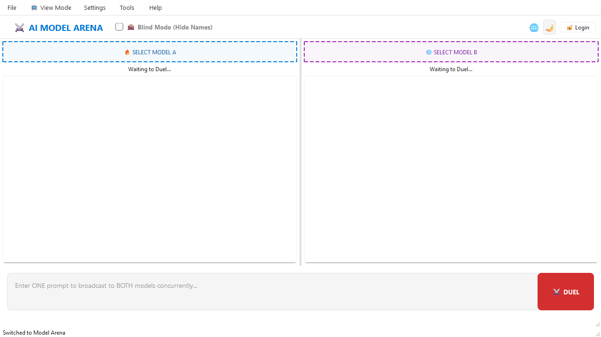
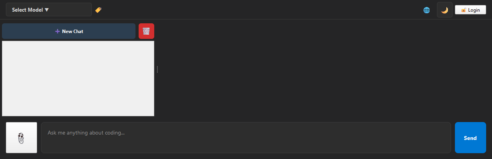
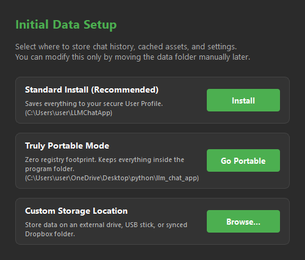
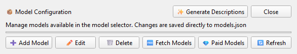
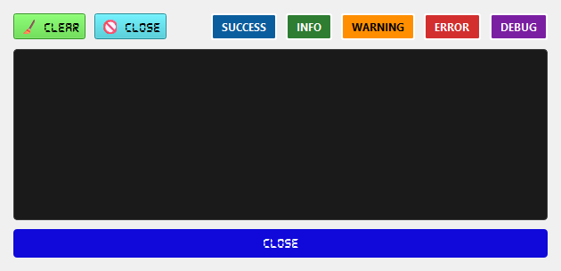
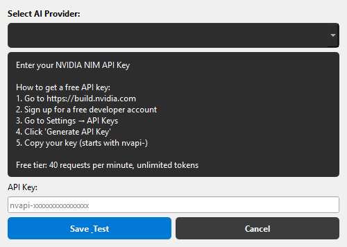
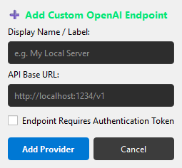

# LLM Chat App

            

A sleek, high-performance desktop chat application built with Python and PySide6. Designed as a universal multi-ecosystem hub, it interfaces seamlessly with **Google Gemini**, **NVIDIA NIM**, **Groq**, **Ollama**, and **LM Studio**—alongside infinite support for your own custom local endpoints—to provide unified streaming, blazing-fast markdown rendering, and enterprise-grade conversation management.

[About](#-about-the-project) • [Features](#-features) • [User Interface Highlights](#-user-interface-highlights) • [Getting Started](#-getting-started) • [Usage](#-usage) • [Project Structure](#-project-structure) • [Tech Stack](#-tech-stack) • [Universal API Server](#-universal-api-server) • [Log System](#-log-system) • [Keyboard Shortcuts](#-keyboard-shortcuts) • [Credits](#-about-the-team--credits) • [License](#-license)

---

## 📖 About the Project

**LLM Chat App** is engineered to be the definitive, secure gateway for modern Artificial Intelligence exploration. Developed for high-velocity prototyping and native desktop comfort, this workstation utility centralizes fragmented AI provider landscapes into a single, performant orchestrator. 

Born from the drive for a truly ecosystem-agnostic environment, it breaks vendor-lock constraints by unifying **Cloud inference** and **Local compute** within one elite codebase. Leveraging hardware acceleration, OS-level credential custody, and recursive Adaptive Memory buffering, it delivers a fluid, virtually limitless conversational cognition engine.

---

## ✨ Features

- ⚔️ **AI Model Arena:** Brand-new competitive benchmark engine. Run dual LLMs concurrently side-by-side with real-time visual comparison, blind-mode evaluation, and victory elections.
- 🧬 **Hybrid Vector RAG Memory:** Deep long-term recollections. Synthesizes high-velocity NumPy TF-IDF crawls with industrial-grade, local Qdrant Vector Database storage for persistent semantic retrieval.
- 🛠️ **Interactive Python Sandbox:** Secure, decoupled execution environment. Spawns fully-isolated processes to automatically compile and execute generated Python and PySide GUI codebases safely on your desktop.
- ⚡ **Zero-Config Auto-Sweep:** Automated discovery of Ollama and LM Studio servers. A non-blocking, isolated background sweeper intelligently probes local ports to sync offline libraries with zero user configuration.
- 🤖 **Scalable Architecture (V6):** Advanced modular chassis natively supporting hot-swappable viewports across **Google**, **NVIDIA**, **Ollama**, **LM Studio**, **Groq**, and **Official OpenAI**.
- ➕ **Unlimited Custom Endpoints:** Dynamically inject custom, private, or locally-hosted model hosts into your roster without writing a single line of code.
- 🏠 **True Offline Capability:** Specialized zero-key mode automatically detects local tooling (like Ollama), bypassing verification blockers entirely.
- 📊 **Live Performance Metrics:** Track AI speed with real-time stats (Time to First Token, Tokens/sec, and usage usage) displayed beautifully after every response.
- 📎 **File Attachments:** Upload code (`.py`, `.js`), text, or data files directly into the chat for instant analysis.
- 📂 **Isolated Model Vaults:** Vendor catalogs are segmented and containerized within dedicated subdirectory resources (e.g., `resources/model_json/models_nvidia.json`), facilitating infinite ecosystem horizontal scale.
- 📦 **Dynamic Model Manager:** Add, edit, or remove models directly from the UI. Group models by provider or developer using the tabbed interface.
- 🔐 **Segmented Key Vault:** Safely manages isolated OS-level keychain credentials for each distinct provider without crossing identities.
- 🔧 **Smart Generation Parameters:** Take granular control over LLM outputs. Tweak temperature and response length via a dedicated UI, or use 'Model Default' to let remote servers decide natively.
- 🧠 **Reasoning Support:** Automatically detects and beautifully formats model "thinking/reasoning" tokens.
- 🎨 **Rich Markdown Rendering:** Stunning display of code blocks with syntax highlighting, tables, and bold formatting.
- 💾 **Robust History Management:** Uses a high-performance **SQLite** backend with **WAL (Write-Ahead Logging)** mode to ensure data integrity and prevent corruption, even during crashes or power loss.
- 🚅 **Instant Loading (HTML Cache):** Near-instant conversation loading thanks to an intelligent HTML caching system that pre-renders messages, bypassing heavy markdown parsing during UI refresh.
- 🔐 **State Memory:** Remembers your API keys, selected models, and theme preferences via `QSettings` (OS-native registry/config).
- 🖥️ **Distraction-Free UI:** Forced maximized, clean light/dark interface so you can focus purely on your prompt.
- 🌓 **Adaptive Theming** – Instantly switch between Dark and Light modes.
- 📌 **Persistent Settings** – API keys, models, and theme preferences survive app restarts.
- 🌐 **Live Connection Status** – Real-time network monitoring with visual indicators (🌐/🔴); automatically recovers from silent disconnects, safely cleans up broken chat history, and instantly unlocks the UI.
- 🛡️ **Intelligent Error Handling:** Categorizes API errors (timeouts, network drops, rate limits) and shows friendly, actionable messages instead of raw error traces.
- 🧠 **Adaptive Memory Compression:** Features a high-performance context intercept layer. Detects usage bursts above 85% and seamlessly performs silent, secondary background synthesis to compact legacy history, unlocking infinite conversation depth.
- 🔄 **Background Model Fetching:** Fetch and test all available ecosystem models in the background. Model Manager closes automatically, progress visible in real-time via the Log menu.
- 📋 **Real-time Log Viewer:** Track model fetching progress, success/failures, and description generation with color-coded, filterable logs (INFO, WARNING, ERROR, SUCCESS, DEBUG).
- ✨ **AI-Powered Description Generation:** Generate one-sentence descriptions for any model using your choice of working model (Llama 4, Gemma 3, etc.). Descriptions persist across app restarts.
- 🏷️ **Developer Tabs:** Models are automatically grouped by developer (Google, Meta, NVIDIA, etc.) in the Model Manager for easier browsing.
- 💰 **Paid Model Support:** Fetch paid models (requires subscription) and merge them with existing free models without losing data.
- 🚀 **Graceful Resource Management:** Implements **Smart Resource Sync** that detects new EXE versions and updates UI files without destructive wiping. Includes robust cleanup logic to ensure all threads and port 5000 are released on exit.
- 🖥️ **System Tray Support:** Minimize to system tray for background operation. API server continues running while app is in tray.
- 🌐 **Universal API Server:** Start a local OpenAI-compatible API server from Tools menu. Connect any IDE (VS Code, Eclipse, IntelliJ) to your selected LLM model.
- 🖥️ **VS Code Extension Support:** Use with Continue extension or build custom extension for advanced features like sending entire files, project folders, and applying AI edits directly.
- 📦 **Storage Management Center:** Move seamlessly between Portable, Standard, and Custom data paths at runtime with transactional relocation and immediate automatic cycle-boot.
- 📂 **Zero-Click Data Reveal:** Instant one-click Windows Explorer shortcuts in settings to navigate directly to your active user profiles and databases.

For detailed API documentation, see [API Documentation](API_SERVER.md)
For IDE integration instructions, see [IDE Integration Guide](IDE_INTEGRATION.md)

---

## 🎨 User Interface Highlights

### 📸 Visual Overview
<p align="center">
  
</p>
<p align="center">
  
  
</p>
<p align="center">
  
  
</p>
<p align="center">
  
  
</p>

📂 **Browse the Full Gallery:** See more detailed interface caps in the [📂 resources/screenshots](./resources/screenshots) folder.

- 🌙 / ☀️ **Theme Toggle**: Click the icon in the top bar to switch themes instantly.
- 🏷️ **Model Info Label**: A subtle italic label next to the dropdown populates with the model description so you know its capabilities at a glance.
- 📋 **Log Menu:** View real-time update logs with filtering by log level. Clear logs when needed.
- ✨ **Generate Descriptions Button:** In Model Manager, select any working model to automatically generate descriptions for all models missing them.
- 📝 **System Instructions:** Access the Instruction Library via Settings to create, edit, and toggle system prompts.
- 🔽 **System Tray Icon:** Right-click for menu options, double-click to restore window from tray.
- **Universal API Server** - Start/stop local API server on port 5000. Checkmark indicates server is running. Compatible with any OpenAI-compatible IDE or plugin.

---

## 🚀 Getting Started

### Prerequisites

- Python 3.12 or higher
- An API Key from your preferred provider (NVIDIA, Google, OpenAI etc.) (Get one at [build.nvidia.com](https://build.nvidia.com/))

### Installation

1. **Clone the repository:**

   ```bash
   git clone https://github.com/Arean82/llm_chat_app.git   
   cd llm_chat_app   
   ```
2. **Create and activate a virtual environment (Optional but recommended):**

   ```bash
   python -m venv venv   
   # Windows  
   venv\Scripts\activate   
   # macOS/Linux   
   source venv/bin/activate   
   ```
3. **Install dependencies:**

   ```bash
   pip install PySide6 openai markdown   
   ```

---

## 💡 Usage

1. Run the application:
   ```bash
   python main.py   
   ```
2. 📸 **First Launch:** A secure login popup will prompt you for your preferred API key (`nvapi-...`).
3. 🤖 **Select Model:** A popup will let you choose your desired AI model.
4. 💬 **Start Chatting:** Type your message. Press `Enter` to send, or `Shift+Enter` for a new line.
5. 📎 **Upload Files:** Click the attachment button to upload code/text for the AI to review.
6. ⏹️ **Stop Generation:** Click the red "Stop" button at any time to halt the response.
7. 🔽 **System Tray:** Click the X button to choose between exiting completely or minimizing to system tray. Double-click tray icon to restore window.
8. 🌐 **API Server:** Go to Tools → Universal API Server to start the API. Configure your IDE extension to use `http://localhost:5000/v1`.

---

## 📁 Project Structure

```text
llm_chat_app/
│
├── main.py                         # 🚀 Entry point
├── LLM_Chat_App_onedir.spec        # PyInstaller spec - One-dir build
├── LLM_Chat_App_onefile.spec       # PyInstaller spec - One-file build
├── LLM_Chat_App_combined.spec      # PyInstaller spec - Both builds
├── README.md                       # 📖 Documentation
├── LICENSE                         # ⚖️ MIT License
├── API_SERVER.md                   # 📡 API documentation
├── IDE_INTEGRATION.md              # 🔌 IDE setup guide
├── requirements.txt                # 📦 Python dependencies
│
├── extension/                       # 📦 IDE Extensions
│   ├── vscode-llm-chat-1.0.1.vsix   # VS Code extension
│   └── jetbrains-llm-chat-1.0.1.zip # JetBrains plugin
│
├── resources/                      # 📦 Static assets & caches
│   ├── app_icon.png                # 🖼️ Application icon
│   ├── app_icon.ico                # 🖼️ Windows icon
│   ├── app_icon.icns               # 🖼️ macOS icon
│   ├── app_icon_linux.png          # 🖼️ Linux icon
│   ├── model_json/                 # 🤖 Segmented vendor model definitions
│   ├── styles.qss                  # 🎨 Global stylesheet
│   ├── user_prompts.json           # 📝 System instructions
│   └── badge_cache/                # ⚡ Auto-generated offline image cache
│
├── ui_designer/                    # 🎨 Qt Designer UI files
│   ├── login_dialog.ui             # 🔐 Login dialog
│   ├── log_viewer.ui               # 📋 Log viewer
│   ├── main_window.ui              # 🖥️ Main window
│   ├── model_edit_dialog.ui        # ✏️ Model edit dialog
│   ├── model_manager.ui            # 📦 Model manager
│   ├── model_popup.ui              # 🤖 Model selector
│   ├── storage_manager.ui          # 📦 Storage configuration
│   └── system_prompt_manager.ui    # 📝 System prompt manager
│
├── ui/                             # 🧩 Python UI logic
│   ├── file_viewer.py              # 📄 Readme/License viewer
│   ├── login_dialog.py             # 🔐 API Key authentication
│   ├── log_viewer.py               # 📋 Log viewer logic
│   ├── main_window.py              # 🖥️ Main app controller
│   ├── model_edit_dialog.py        # ✏️ Model add/edit/delete
│   ├── model_manager.py            # 📦 Model manager logic
│   ├── model_popup.py              # 🤖 Model selector logic
│   ├── storage_manager_dialog.py   # 📦 Storage relocation wizard
│   └── system_prompt_manager.py    # 📝 System prompt logic
│
├── logic/                          # ⚙️ Backend engine
│   ├── api_server.py               # 🌐 Universal API server
│   ├── llm_client.py               # 🔌 Universal API orchestration wrapper
│   ├── chat_worker.py              # 🧵 Threading for streaming
│   └── conversation_manager.py     # 💾 Save/load conversations
│
├── workers/                        # 🧵 Background workers
│   ├── description_generator.py    # ✨ AI description generation
│   ├── model_fetch_worker.py       # 🔄 Fetch & test models
│   ├── paid_model_fetch_worker.py  # 💰 Paid model support
│   └── update_logger.py            # 📋 Real-time logging
│
└── utils/                          # 🛠️ Helpers
    ├── constants.py                # 📌 App constants
    ├── helpers.py                  # 🔧 Helper functions
    ├── model_config.py             # 🧠 Model context limits
    └── path_utils.py               # 📁 PyInstaller & dev path resolver
```

---

## 🧱 Tech Stack

                                   

---

## ⚙️ Configuration & Data Storage

This application does not use local `.env` files or plaintext config files for sensitive data.

- **API Credentials:** Migrated away from plaintext. Securely injected into the OS vault subsystem using the Python `keyring` module (Windows Credential Manager / macOS Keychain).
- **UI Settings:** Generic layout preferences stored using `QSettings`. 
  - **Portable Mode:** Saved to `settings.ini` in the application folder (zero system footprint).
  - **Standard/Custom Mode:** Saved securely via native OS configurations.
    - *Windows:* Saved in the Registry (`HKEY_CURRENT_USER\Software\LLMChatApp\Settings`).
    - *macOS:* Saved in `~/Library/Preferences/com.LLMChatApp.Settings.plist`.
    - *Linux:* Saved in `~/.config/LLMChatApp/Settings.conf`.
- **Data Root:** Chat history (`chat_history.db`), logs, caches, and configs dynamically map to one centralized Data Root based on user preference (User Profile, Portable Folder, or Custom network drive).


---

## 🌐 Universal API Server

- Fully compatible with OpenAI-style API  `/v1/chat/completions` (used by IntelliJ plugin).
- Start from **Tools → Universal API Server** (✅ = running). Server runs on `http://localhost:5000`

### Endpoints

| Endpoint                 | Method | Description                     |
| ------------------------ | ------ | ------------------------------- |
| `/health`              | GET    | Server status                   |
| `/v1/models`           | GET    | List model                      |
| `/v1/chat/completions` | POST   | OpenAI-compatible chat endpoint |

### VS Code Extension

Install `extension/vscode-llm-chat-1.0.1.vsix`:

1. VS Code Extensions (Ctrl+Shift+X)
2. Click "..." → "Install from VSIX"

### Other IDEs

Configure any OpenAI-compatible extension with:

- **URL:** `http://localhost:5000/v1`
- **API Key:** `llm-local-auth-82c4f3eb0d` (Mandatory local token)

---

## 📋 Log System

The application features a comprehensive logging system for background operations:

- **Real-time Updates:** All fetch and generation progress appears instantly in the Log Viewer
- **Color-coded Levels:** INFO (green), SUCCESS (blue), WARNING (yellow), ERROR (red), DEBUG (purple)
- **Filterable:** Toggle specific log levels on/off
- **Persistent Storage:** Logs saved to `resources/update_log.txt` and survive app restarts
- **Background Operations:** Model fetching and description generation run without blocking the UI

---

## ⌨️ Keyboard Shortcuts

| **Key**                      | **Action**                                                  |
| :--------------------------------- | :---------------------------------------------------------------- |
| `Enter`                          | Send message                                                      |
| `Shift + Enter`                  | Insert new line                                                   |
| `F11`                            | Toggle true Fullscreen                                            |
| `Esc`                            | Exit true Fullscreen                                              |
| `Close button (X)` or `Alt+F4` | Shows exit options (Exit Application / Minimize to Tray / Cancel) |
| `Ctrl+Alt+S`                     | Toggle Universal API Server (if shortcut configured)              |
| `Ctrl+N` | New Conversation |
| `Ctrl+S` | Save Conversation |
| `Ctrl+L` | Load Conversation |
| `Ctrl+M` | Minimize to Tray |
| `Ctrl+Q` | Exit |
| `Ctrl+D` | Clear Chat |
| `Ctrl+Shift+C` | Copy Last Response |

---

## 🤝 Contributing

Contributions, issues, and feature requests are highly welcome! Whether it's fixing a bug, improving the UI, or adding support for a new API, your help is appreciated.

To contribute:

1. **Fork** the Project
2. Create your **Feature Branch** (`git checkout -b feature/AmazingFeature`)
3. **Commit** your Changes (`git commit -m 'Add some AmazingFeature'`)
4. **Push** to the Branch (`git push origin feature/AmazingFeature`)
5. Open a **Pull Request**

**Guidelines:**

- Please follow standard Python [PEP 8](https://peps.python.org/pep-0008/) conventions.
- Keep the UI consistent with the current light/dark theme logic.
- If adding new API endpoints, ensure they are handled safely in the `logic/` folder without blocking the main UI thread.

---

## ⚠️ Disclaimer

This software is provided as-is, free of charge, for educational and personal use purposes.

- **AI Accuracy:** This application interfaces with third-party Large Language Models (LLMs). The developers of this application do not control, endorse, or guarantee the accuracy, completeness, or appropriateness of the AI-generated responses. AI models can produce incorrect, biased, or offensive content.
- **User Responsibility:** You are solely responsible for any prompts you submit and any outputs you rely on. Always verify critical information generated by AI.
- **API Usage:** This app interfaces with multiple third-party AI APIs (NVIDIA, Google, OpenAI, Ollama). You are responsible for managing your own API keys, adhering to NVIDIA's Terms of Service, and monitoring your own API usage limits and quotas.
- **No Liability:** The maintainers of this repository shall not be held liable for any damages, data loss, or issues arising from the use of this software.

---

## 🔨 Building from Source (Developer Guide)

If you want to build the distributable installers yourself, follow the OS-specific steps below.

*Note: You must build on the target OS (Windows builds for Windows, Mac builds for Mac, Linux builds for Linux).*

### Prerequisites

1. Install the app dependencies: `pip install PySide6 openai markdown`
2. Install PyInstaller: `pip install pyinstaller`
3. Install Pillow for icon generation: `pip install Pillow`
4. Generate the required OS icon files from your source `resources/app_icon.png`:

   ```bash
   python -c "from PIL import Image; img = Image.open('resources/app_icon.png'); img.save('resources/app_icon.ico', sizes=[(16,16), (32,32), (48,48), (64,64), (128,128), (256,256)]); img.resize((256, 256)).save('resources/app_icon_linux.png'); print('Icons generated!')"
   ```

   *(Note: To generate the `.icns` for macOS, you must run `iconutil` on a Mac).*

### Step 1: Build the Executable (All OS)

Run this from the project root. The project includes three spec files for different build types:

```bash
# One-dir build (folder with exe + dependencies)
pyinstaller LLM_Chat_App_onedir.spec

# One-file build (single executable)
pyinstaller LLM_Chat_App_onefile.spec

# Combined build (creates both One-file and One-dir)
pyinstaller LLM_Chat_App_combined.spec
```

**Build outputs:**

- One-dir: `dist/LLM_Chat_dir/` (folder containing the executable and all dependencies)
- One-file: `dist/LLM_Chat_one_file/LLM Chat App.exe` (single executable file)
- Combined: Both outputs are generated simultaneously

- On first launch, the executable checks directory permissions. If running from a restricted system folder (like `C:\Program Files`), it automatically creates data resources inside `AppData` to ensure zero-crash operation.
- If run from a writable folder (USB drive/Desktop), it prompts the user to select between **Portable**, **Standard**, or **Custom** storage paths.
- Uses **Smart Sync** to safely unpack current UI versions to the active Data Root without wiping user configs.


**Test the executable** before proceeding to package it!

### Step 2: Create the OS Installer

#### 🪟 Windows (Inno Setup)

1. Download and install [Inno Setup](https://jrsoftware.org/isdl.php).
2. Place `installer_script.iss` in the project root folder.
3. Open the `installer_script.iss` file in Inno Setup.
4. Go to **Build > Compile** (or press `Ctrl+F9`).
5. *Output:* `installer_output/LLM_Chat_App_Setup_v6.0.0.exe`

The installer copies the entire `dist/LLM_Chat_dir/` folder to `Program Files` and creates desktop/start menu shortcuts.

#### 🐧 Linux (DEB & AppImage)

For Ubuntu/Debian, use the automated build scripts:

**1. Create a DEB Installer:**
```bash
# Build onedir first
pyinstaller LLM_Chat_App_onedir.spec
# Run the automation script
bash build_deb.sh
# Install
sudo dpkg -i llmchatapp_6.0.0.deb
```

**2. Create a Portable AppImage:**
```bash
# Build onedir first
pyinstaller LLM_Chat_App_onedir.spec
# Run the AppImage script
bash build_appimage.sh
```

Uninstall DEB: `sudo apt remove llmchatapp`

#### 🍎 macOS (PKG)

For macOS (Intel & Apple Silicon M1/M2/M3/M4), use the automated build script:

```bash
# Build onedir/bundle first
pyinstaller LLM_Chat_App_onedir.spec
# Run the automation script
bash build_mac.sh
```

The compiled app leverages a dynamic configuration manager on the first boot to determine file locations:

1. **Standard Mode:** Installs configurations to the standard secure User Home location (e.g., `~\LLMChatApp`). Perfect for standard installations.
2. **Truly Portable Mode:** Packs absolutely every single byte—including SQL databases, caches, and even the settings files—into the same folder as the `.exe`. Safe for thumb drives.
3. **Custom Mode:** Routes all data folders to a network drive or synchronized folder of the user's choosing (e.g., Dropbox/OneDrive).

Regardless of selection, the target root directory will structure itself like this:

- `/conversations/` - SQLite database `chat_history.db`
- `/resources/` - Extracted styling and JSON manifests
- `/resources/badge_cache/` - Dynamic cached images
- `/ui_designer/` - Extracted interface schemas
- `/resources/update_log.txt` - Global application log file


---

## 👨‍💻 About the Team & Credits

This framework is architected and curated with the vision of building transparent, universal gates into advanced AI technologies.

*   **Lead Architect:** **Arean Narrayan** ([@Arean82](https://github.com/Arean82))
*   **Design Ethos:** Deliver highly secure, agnostic interfaces free of platform bias or maintenance decay.

---

## 📅 Change Log

### v6.1.0 – High-Performance Hybrid Memory & Autonomous Sandboxing
- 🧬 **Hybrid RAG Persistence**: Fused rapid NumPy crawling with Qdrant local vector stores for deep, enterprise-grade persistent semantic recollection.
- 🛠️ **Interactive Execution Sandbox**: Integrated isolated, async process forks (`QProcess`) to dynamically compile and run Python/PySide prototypes inline.
- 🪄 **Vision-to-Sandbox Hook**: Automatic base64 visual parsing pipeline enables immediate functional sandboxing directly from image mockup prompt requests.
- ⚡ **Async Zero-Config Sweep**: Non-blocking startup daemon probes local localhost ports automatically, mapping Ollama and LM Studio catalogs instantly.
- 🎨 **Dynamic High-Contrast Accessible UI**: Programmatic `QPalette` injection guaranteeing readable placeholder texts and input layouts across both light and dark themes.

### v6.0.0 – Universal Orchestration & Context Evolution
- 🚀 **Adaptive Memory Compression**: Seamless background context synthesis unlocking infinite conversation depths.
- ⚔️ **AI Model Arena**: Inaugural dual-concurrent comparison engine for competitive LLM benchmarking.
- 🌍 **Universal Ecosystem Grid**: Formalized native integrations for Google, Groq, Ollama, and LM Studio.
- 🔐 **Segmented Vault**: Advanced OS-level credential isolation protecting independent provider keys.
- 📦 **Transactional Storage**: Introduced hot-swappable runtime path management for user data relocation.
- ✨ **System UI Overhaul**: Migrated monolith view to High-Velocity Modular Stack for optimized memory cycles.

### v5.0.0 – Modern Infrastructure Foundations
- 💾 **SQLite Persistence Core**: Heavy-duty transactional chat logging with WAL-mode safety locks.
- 🤖 **Dynamic Catalog Expansion**: Replaced static indices with segmented runtime ecosystem JSON catalogs.
- 🌐 **Flask API Architecture**: Introduction of the background-threading local gateway for IDE bridges.
- 🔧 **Smart Model Tuning**: Precision UI handlers added for manual Temperature and Token-Limit overrides.
- 📡 **Extension Ecosystem V1**: Official stable launch of packaged VSCode and JetBrains connectivity clients.

### v4.0.0 – Framework Maturation
- 📜 **Library Interface**: Deployed the persistent instruction repository and system-prompt configurator.
- 📋 **Active Log Inspector**: Real-time event loop monitoring specifically for ecosystem fetches.
- ⚙️ **Model Manager V1**: Basic graphical table added for provider addition/removal management.
- 🚀 **Streaming Refinement**: Optimized real-time token stream deserialization to eliminate jitter lag.

---

## 📝 License

This project is licensed under the MIT License - see the [LICENSE](LICENSE) file for details.
