# LLM Chat App (v8.0 Stable Release)

              

A sleek, high-performance desktop chat application built with Python and PySide6. Designed as a universal multi-ecosystem hub, it interfaces seamlessly with **Google Gemini**, **NVIDIA NIM**, **Groq**, **Ollama**, and **LM Studio**—alongside infinite support for your own custom local endpoints—to provide unified streaming, blazing-fast markdown rendering, and enterprise-grade conversation management.

[About](#-about-the-project) • [Features](#-features) • [User Interface Highlights](#-user-interface-highlights) • [Getting Started](#-getting-started) • [Usage](#-usage) • [Project Structure](#-project-structure) • [Tech Stack](#-tech-stack) • [Universal API Server](#-universal-api-server) • [Log System](#-log-system) • [Keyboard Shortcuts](#-keyboard-shortcuts) • [Credits](#-about-the-team--credits) • [License](#-license)

---

## 📖 About the Project

**LLM Chat App** is engineered to be the definitive, secure gateway for modern Artificial Intelligence exploration. Developed for high-velocity prototyping and native desktop comfort, this workstation utility centralizes fragmented AI provider landscapes into a single, performant orchestrator.

Born from the drive for a truly ecosystem-agnostic environment, it breaks vendor-lock constraints by unifying **Cloud inference** and **Local compute** within one elite codebase. Leveraging hardware acceleration, OS-level credential custody, and recursive Adaptive Memory buffering, it delivers a fluid, virtually limitless conversational cognition engine.

---

## ✨ Features

- ☁️ **SaaS Multi-Tenant Gateway:** An enterprise-grade web orchestration layer supporting Admin Vault and BYOK (Bring Your Own Key) tiers. Features real-time telemetry, Dead Letter Queues (DLQ), live worker metrics, and physical tenant isolation.
- ✨ **Premium Glassmorphic UI:** Stunning 4K visual design featuring dynamic glowing gradients, micro-animations, and seamless Dark/Light theme switching for both the Desktop and Web environments.
- ⚔️ **AI Model Arena:** Brand-new competitive benchmark engine. Run dual LLMs concurrently side-by-side with real-time visual comparison, blind-mode evaluation, and victory elections.
- 🧬 **Hybrid Vector RAG Memory:** Deep long-term recollections. Synthesizes high-velocity NumPy TF-IDF crawls with industrial-grade, local Qdrant Vector Database storage for persistent semantic retrieval.
- 🛠️ **Interactive Python Sandbox:** Secure, decoupled execution environment. Spawns fully-isolated processes to automatically compile and execute generated Python and PySide GUI codebases safely on your desktop.
- ⚡ **Zero-Config Auto-Sweep:** Automated discovery of Ollama and LM Studio servers. A non-blocking, isolated background sweeper intelligently probes local ports to sync offline libraries with zero user configuration.
- 🤖 **Scalable Architecture (V8.0):** Advanced modular chassis natively supporting hot-swappable viewports across **Google**, **NVIDIA**, **Ollama**, **LM Studio**, **Groq**, and **Official OpenAI**.
- 🎛️ **Dynamic Capability-Based Filtering:** Intelligently filter models by **General Chat**, **Supports Tools**, **Vision/Multimodal**, **Embeddings**, **Rerankers**, or **Audio/Voice** using a unified, re-ordered UI filter that prioritizes active conversational models first.
- 📂 **Universal Model Cataloging:** Dynamically auto-classifies and indexes non-chat models from API endpoints during background fetches. The chat selection popup remains cleanly partitioned (strictly showing chat-capable models), while specialized layers (Embeddings, Rerankers, Audio) are cataloged for backend integrations.
- 🔍 **Pluggable Two-Stage Reranking Pipeline:** Maximizes code context and prompt grounding precision. Pairs candidate retrieval (Top 20) with high-recall cross-encoder rerankers (Local BGE / Cloud Cohere / Custom OpenAPI-compatible endpoints), featuring Hybrid A Structural Code Bias (scoring class/def blocks higher) and Hybrid B Diversity MMR (Maximal Marginal Relevance) overlap pruning.
- ➕ **Unlimited Custom Endpoints:** Dynamically inject custom, private, or locally-hosted model hosts into your roster without writing a single line of code.
- 🏠 **True Offline Capability:** Specialized zero-key mode automatically detects local tooling (like Ollama), bypassing verification blockers entirely.
- 📊 **Live Performance Metrics:** Track AI speed with real-time stats (Time to First Token, Tokens/sec, and usage usage) displayed beautifully after every response.
- 📎 **File Attachments:** Upload code (`.py`, `.js`), text, or data files directly into the chat for instant analysis.
- 🔐 **Centralized Credential Hub:** Unified single-pane-of-glass management for all API keys, base URLs, and ecosystems. Features SDK-to-Ecosystem mapping and isolated OS-level vault storage (Audit ID 046).
- 🛡️ **Secure Transition Gate:** Switching "Live" ecosystems now triggers a mandatory logout confirmation gate, preventing session leakage and ensuring clean state transitions (Audit ID 028).
- 🔄 **Background Model Fetching:** Smarter "Fetch Models" logic with ecosystem-aware background workers and real-time status telemetry (Audit ID 024).
- 🛡️ **Universal Key-Aware Filtering:** The UI automatically hides models from providers lacking active credentials, ensuring a zero-pollution catalog (Audit ID 047).
- ✨ **Premium Visual Identity:** Upgraded to a custom-generated 4K glassmorphism design with optimized assets for Windows (.ico), macOS (.icns), and Linux (.png) (Audit ID 018).
- 🔧 **Smart Tabbed Generation Parameters:** Take granular control over LLM outputs and RAG options through a beautiful, responsive tabbed interface. Tweak temperature, presets, and response lengths under "Model Parameters", and configure the dynamic two-stage reranker, endpoints, and secure API keys under "Retrieval Reranking".
- 🧠 **Reasoning Support:** Automatically detects and beautifully formats model "thinking/reasoning" tokens.
- 🎨 **Rich Markdown Rendering:** Stunning display of code blocks with syntax highlighting, tables, and bold formatting.
- 💾 **Robust History Management:** Uses a high-performance **SQLite** backend with **WAL (Write-Ahead Logging)** mode to ensure data integrity and prevent corruption, even during crashes or power loss.
- 🚅 **Instant Loading (HTML Cache):** Near-instant conversation loading thanks to an intelligent HTML caching system that pre-renders messages, bypassing heavy markdown parsing during UI refresh.
- 🔐 **State Memory:** Remembers your API keys, selected models, and theme preferences via `QSettings` (OS-native registry/config).
- 🖥️ **Distraction-Free UI:** Forced maximized, clean light/dark interface so you can focus purely on your prompt.
- 🌓 **Adaptive Theming** – Instantly switch between Dark and Light modes.
- 📌 **Persistent Settings** – API keys, models, and theme preferences survive app restarts.
- 🌐 **Live Connection Status** – Real-time network monitoring with visual indicators (🌐/🔴); automatically recovers from silent disconnects, safely cleans up broken chat history, and instantly unlocks the UI.
- 🛡️ **Intelligent Error Handling:** Categorizes API errors (timeouts, network drops, rate limits) and shows friendly, actionable messages instead of raw error traces.
- 🧠 **Adaptive Memory Compression:** Features a high-performance context intercept layer. Detects usage bursts above 85% and seamlessly performs silent, secondary background synthesis to compact legacy history, unlocking infinite conversation depth.
- 🔄 **Background Model Fetching:** Fetch and test all available ecosystem models in the background. Model Manager closes automatically, progress visible in real-time via the Log menu.
- 📋 **Real-time Log Viewer & Telemetry:** Track model fetching progress, API health, and system throughput with a centralized Telemetry Observability Dashboard.
- ✨ **AI-Powered Description Generation:** Generate one-sentence descriptions for any model using your choice of working model (Llama 4, Gemma 3, etc.). Descriptions persist across app restarts.
- 🏷️ **Developer Tabs:** Models are automatically grouped by developer (Google, Meta, NVIDIA, etc.) in the Model Manager for easier browsing.
- 💰 **Paid Model Support:** Fetch paid models (requires subscription) and merge them with existing free models without losing data.
- 🚀 **Graceful Resource Management:** Implements **Smart Resource Sync** and completely safe OS-level thread signaling (replacing unsafe termination) to guarantee absolute GUI state stability and memory integrity.
- 🖥️ **System Tray Support:** Minimize to system tray for background operation. API server continues running while app is in tray.
- 🌐 **Universal API Server:** Start a local OpenAI-compatible API server from Tools menu. Connect any IDE (VS Code, Eclipse, IntelliJ) to your selected LLM model.
- 🖥️ **VS Code Extension Support:** Use with Continue extension or build custom extension for advanced features like sending entire files, project folders, and applying AI edits directly.
- 📦 **Storage Management Center:** Move seamlessly between Portable, Standard, and Custom data paths at runtime with transactional relocation and immediate automatic cycle-boot.
- 📂 **Zero-Click Data Reveal:** Instant one-click Windows Explorer shortcuts in settings to navigate directly to your active user profiles and databases.
- 🧠 **Semantic Caching:** High-speed Jaccard Similarity matching for Semantic RAG caching, dramatically reducing token usage on identical semantic queries.

For detailed API documentation, see [API Documentation](API_SERVER.md)
For IDE integration instructions, see [IDE Integration Guide](IDE_INTEGRATION.md)

---

## 🎨 User Interface Highlights

### 📸 Visual Overview

|              Main Application Chassis              |                 Seamless Workstation Initialization                 |
| :-------------------------------------------------: | :------------------------------------------------------------------: |
| 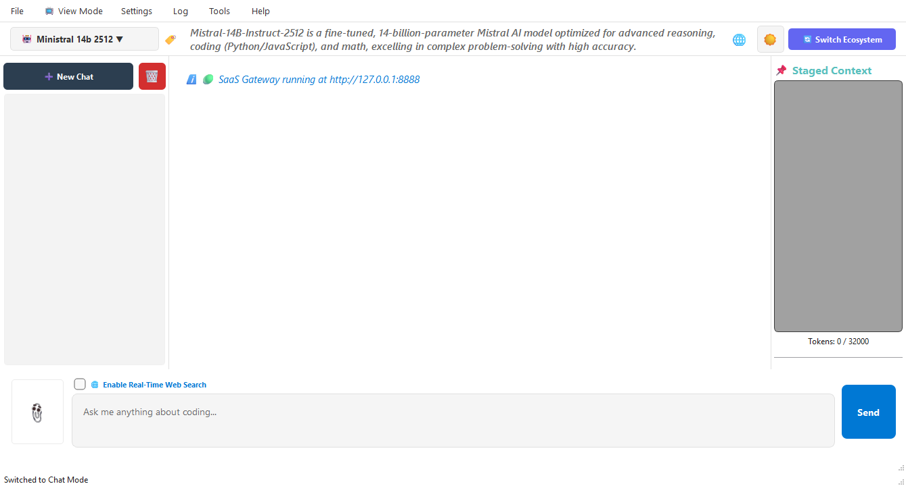 | 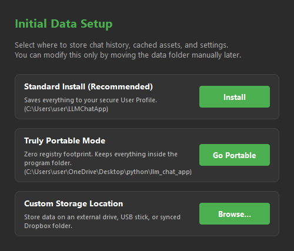 |

|           The AI Model Arena Benchmarking Suite           |                Dynamic Log Telemetry Dashboard          |
| :-------------------------------------------------------: | :-----------------------------------------------: |
| 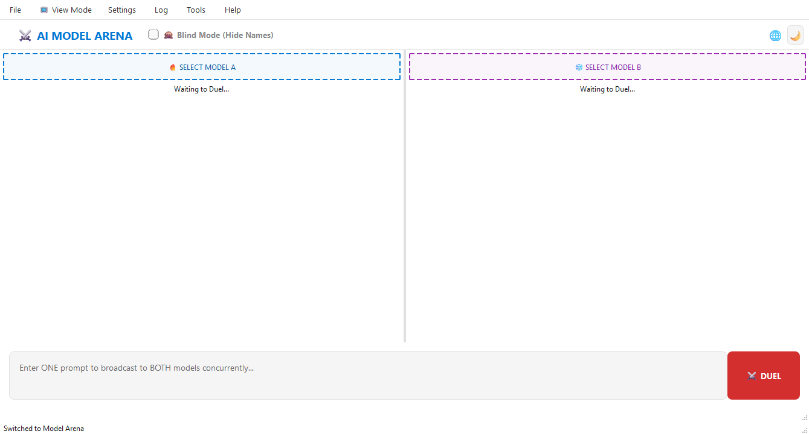 | 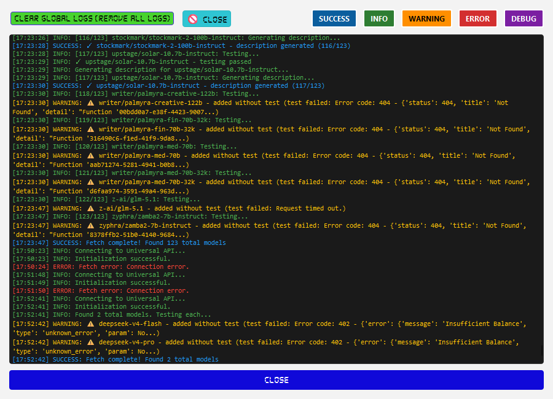 |

|              Modular Catalog Model Manager              |                System Prompt Manager                |
| :-----------------------------------------------------: | :-------------------------------------------------: |
| 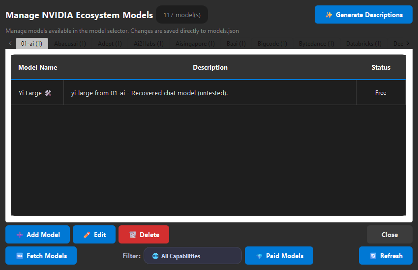 | 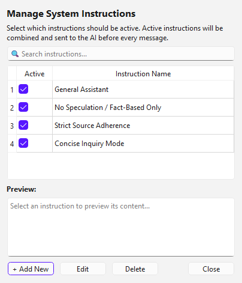 |

|                Segmented Keyring Authentication Vault                |                Custom Private Endpoint Integration                |
| :-------------------------------------------------------------------: | :----------------------------------------------------------------: |
| 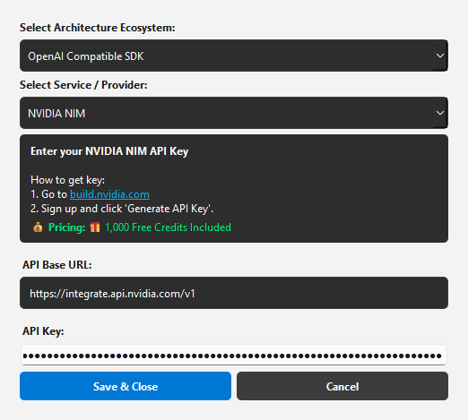 | 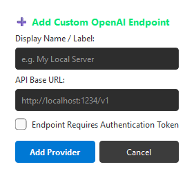 |

|                Smart Generation Parameters                 |
| :--------------------------------------------------------: |
| 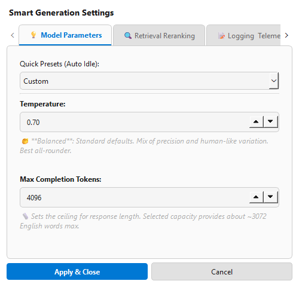     |

### 🛠️ Operator Tools (Enterprise Utilities)

The application ships with isolated, administrative Operator Tools that execute completely outside the main process to ensure safety and bypass UI locks.

|           Migration Companion Dashboard           |           Admin Reset Console           |
| :-----------------------------------------------: | :-------------------------------------: |
|  | 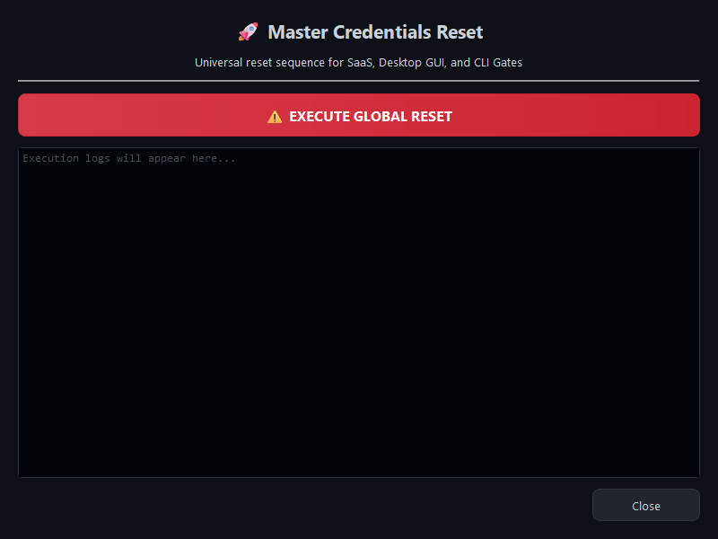 |

- **Migration Companion**: An automated database and configuration relocator tool. It safely migrates Turso SQL credentials, Local SQLite blobs, Qdrant Vector Data, and user profiles across environments (Local to SaaS, or SaaS to Local).
- **Admin Reset Utility**: A specialized recovery tool designed to purge corrupted registries, wipe compromised API keys, and re-provision default Admin/Tenant databases without touching user chat history.

📂 **Browse the Full Gallery:** See more detailed interface caps in the [📂 resources/screenshots](./resources/screenshots) folder.

- 🌙 / ☀️ **Theme Toggle**: Click the icon in the top bar to switch themes instantly. The SaaS web portal now defaults to a premium Light Theme.
- 🏷️ **Model Info Label**: A subtle italic label next to the dropdown populates with the model description so you know its capabilities at a glance.
- 📋 **Log Menu:** View real-time update logs with filtering by log level. Clear logs when needed.
- ✨ **Generate Descriptions Button:** In Model Manager, select any working model to automatically generate descriptions for all models missing them.
- 📝 **System Instructions:** Access the Instruction Library via Settings to create, edit, and toggle system prompts.
- 🔽 **System Tray Icon:** Right-click for menu options, double-click to restore window from tray.
- **Universal API Server** - Start/stop local API server on port 5000. Checkmark indicates server is running. Compatible with any OpenAI-compatible IDE or plugin.

---

## 🚀 Getting Started

### Prerequisites

- Python 3.12 or higher
- An API Key from your preferred provider (NVIDIA, Google, OpenAI etc.) (Get one at [build.nvidia.com](https://build.nvidia.com/))

### Installation

1. **Clone the repository:**

   ```bash
   git clone https://github.com/Arean82/llm_chat_app.git   
   cd llm_chat_app   
   ```
2. **Create and activate a virtual environment (Optional but recommended):**

   ```bash
   python -m venv venv   
   # Windows  
   venv\Scripts\activate   
   # macOS/Linux   
   source venv/bin/activate   
   ```
3. **Install dependencies:**

   ```bash
   pip install -r requirements.txt   
   ```

---

## 💡 Usage

1. Run the application:
   ```bash
   python main.py   
   ```
2. 🔑 **Secure Authentication Gate:** On startup, you will be greeted by the **Quantum Admin Login Gateway**. Sign in with your Super Admin credentials (`admin` / `admin` by default). Your credentials are validated against the partitioned database layer.
3. 📸 **Dynamic Ecosystem Configuration:** If no ecosystem is active, the **Switch Ecosystem** dialog appears. Enter your API Key or select keyless local providers. Your keys are immediately encrypted using zero-trust PBKDF2 ciphers derived from your master password and securely stored in your OS keychain.
4. 🤖 **Select Model:** Click the chat model selector in the main window to choose from your active providers.
5. 💬 **Start Chatting:** Type your message. Press `Enter` to send, or `Shift+Enter` for a new line.
6. 📎 **Upload Files:** Click the attachment button to upload code/text for the AI to review.
7. ⏹️ **Stop Generation:** Click the red "Stop" button at any time to halt the response.
8. 🔽 **System Tray:** Click the X button to choose between exiting completely or minimizing to system tray. Double-click tray icon to restore window.
9. 🌐 **API Server:** Go to Tools → Universal API Server to start the API. Configure your IDE extension to use `http://localhost:5000/v1`. You can securely manage your active keys and toggle the server directly via the CLI by running `python main.py --api-manager`.

---

## 📁 Project Structure

```text
llm_chat_app/
│
├── main.py                         # 🚀 Entry point
├── LLM_Chat_App_onedir.spec        # PyInstaller spec - One-dir build (App only)
├── LLM_Chat_App_onefile.spec       # PyInstaller spec - One-file build (App only)
├── LLM_Chat_App_mac.spec           # PyInstaller spec - macOS .app bundle (App only)
├── LLM_Chat_App_onedir_full.spec   # PyInstaller spec - One-dir build (App + Operator Tools)
├── LLM_Chat_App_onefile_full.spec  # PyInstaller spec - One-file build (App + Operator Tools)
├── LLM_Chat_App_mac_full.spec      # PyInstaller spec - macOS .app bundle (App + Operator Tools)
├── build_deb.sh                    # 📦 Linux DEB compile & bundler script
├── build_appimage.sh               # 📦 Linux AppImage compile & bundler script
├── build_mac.sh                    # 📦 macOS PKG installer compile script
├── build_all_plugins.bat           # 📦 Windows plugins compile & bundler script
├── build_all_plugins.sh            # 📦 Unix plugins compile & bundler script
├── README.md                       # 📖 Documentation
├── LICENSE                         # ⚖️ MIT License
├── SECURITY.md                     # 🛡️ Security policy and vulnerability disclosure
├── API_SERVER.md                   # 📡 API documentation
├── IDE_INTEGRATION.md              # 🔌 IDE setup guide
├── STRATEGIC_EVOLUTION_REPORT.md   # 📈 Phase 2 evolution blueprint
├── PROJECT_AUDIT_REPORT.md         # 🛡️ Master vulnerability remediation ledger
├── WORKING_DOCUMENT_V8_ATTAINMENT.md # 📓 Tactical manual for v8 Headless/SaaS attainment
├── SAAS_STORAGE_ARCHITECTURE_PLAN.md # 🗃️ SaaS high-concurrency multi-tenant database blueprint
├── requirements.txt                # 📦 Python dependencies
├── HEADLESS_GUIDE.md               # 🖥️ Headless Mode usage guide
├── test_reranker.py                # 🧪 Legacy offline reranking validation script
├── vector_db/                      # 💾 Persistent Qdrant dense semantic retrieval (Local DB)
│
├── operator_tools/                 # 🔧 Isolated Operator Admin Portfolio (Phase 10.3)
│   ├── admin_reset/                # 🔐 Universal Master Password Reset (MVC Architecture)
│   │   ├── core/
│   │   │   └── headless_reset.py   # CLI/Daemon logic engine
│   │   ├── ui_assets/
│   │   │   └── reset_admin.ui      # Qt Designer UI layout
│   │   └── reset_admin.py          # MVC Controller entrypoint
│   ├── migration/                  # 🔄 Standalone DB Relocator (MVC Architecture)
│   │   ├── ui_assets/
│   │   │   └── migration_companion.ui
│   │   └── migration_companion.py  # GUI + CLI/Headless Controller entrypoint
│
├── saas/                           # 🌐 Quantum SaaS Web Portal (V7)
│   ├── app.py                      # 🛡️ Secure SaaS Gateway & JWT Server
│   ├── config.ini                  # ⚙️ SaaS configuration (driver selection, network, SMTP)
│   ├── tenant_db.py                # 🗄️ Factory Switchboard (Turso/Postgres/MySQL routing)
│   ├── tenant_drivers/             # 🔌 Pluggable Multi-Backend Tenant Database Drivers
│   │   ├── base_tenant_driver.py   # 📄 Abstract Base Class (22 abstract methods)
│   │   ├── turso_tenant_driver.py  # ⚡ Turso/libSQL WAL driver (default)
│   │   ├── postgres_tenant_driver.py # 🐘 PostgreSQL psycopg2 enterprise driver
│   │   └── mysql_tenant_driver.py  # 🐬 MySQL/MariaDB pymysql driver
│   ├── static/                     # 🎨 Glassmorphism Styles & Assets
│   └── templates/                  # 📐 Modular Portal UI Blueprints (Phase 8 Modularization)
│       ├── layouts/
│       │   └── base.html           # 📐 Global HTML base shell (Boilerplate, scripts, layout logic)
│       ├── partials/
│       │   ├── auth_screen.html    # 🔐 Pre-flight secure Login/Registration portal gate
│       │   ├── sidebar.html        # 🧭 Navigation sidebar & orbit session badges
│       │   ├── header.html         # 📊 Telemetry indicators & active completions selectors
│       │   ├── chat_pane.html      # 💬 Dynamic scroll viewport & chat welcoming panels
│       │   ├── memory_screen.html  # 🧠 RAG document index manager
│       │   └── admin_screen.html   # 👑 Operator console dashboard, DLQ rows & user management
│       ├── modals/
│       │   ├── credentials.html    # ⚙️ settings tabbed hub: dynamic custom LLM providers
│       │   ├── system_health.html  # 🌡️ Observability: worker stats & queue tracking
│       │   ├── settings.html       # 🔐 security: dynamic master password manager
│       │   ├── node_config.html    # ⚙️ tabbed advanced tuning, sliders & email alerts
│       │   └── model_selection.html # 🤖 floating catalog selector modal
│       └── index.html              # 🧩 Clean coordinate template wrapper (29 lines)
│
├── extension/                       # 📦 IDE Extensions (Packaged Binaries)
│   ├── vscode-llm-chat-2.0.0.vsix   # VS Code extension installer
│   └── jetbrains-llm-chat-2.0.0.zip # JetBrains plugin installer
│
├── vscode-llm-chat/                # 💻 VS Code Extension (TypeScript Source)
│   ├── extension.ts                # 🔌 Extension activation, secrets & onboarding webview
│   └── package.json                # 📦 Extension configuration manifest
│
├── jetbrains-llm-chat/             # 💻 JetBrains IntelliJ Extension (Kotlin Source)
│   ├── src/main/kotlin/com/llmchat/ # 📂 Kotlin settings configurable, state & dialog codebase
│   └── build.gradle.kts            # ⚙️ Gradle build and dependency manifest
│
├── resources/                      # 📦 Static assets & caches
│   ├── app_icon.png                # 🖼️ Master UI icon (1024x1024)
│   ├── app_icon.ico                # 🖼️ Windows native icon (Multi-res)
│   ├── app_icon.icns               # 🖼️ macOS native icon (Retina)
│   ├── app_icon_linux.png          # 🖼️ Linux native icon (512x512)
│   ├── model_json/                 # 🤖 Segmented vendor model definitions
│   ├── styles.qss                  # 🎨 Global stylesheet
│   ├── user_prompts.json           # 📝 System instructions
│   └── badge_cache/                # ⚡ Auto-generated offline image cache
│
├── ui_designer/                    # 🎨 Qt Designer UI layouts
│   ├── main_window.ui              # 🖥️ Main window shell layout
│   ├── chat_mode.ui                # 💬 Full Chat application canvas
│   ├── arena_mode.ui               # ⚔️ Model Arena duel canvas
│   ├── gen_settings.ui             # ⚙️ Parametric configuration box
│   ├── login_dialog.ui             # 🔐 Authentication vault popup
│   ├── model_manager.ui            # 📦 Catalog addition matrix
│   ├── custom_provider_dialog.ui   # ➕ Custom API endpoint creator
│   ├── log_viewer.ui               # 📋 Event telemetry monitor
│   ├── model_popup.ui              # 🤖 Floating picker widget
│   └── storage_manager.ui          # 📦 Relocation pathway wizard
│
├── ui/                             # 🧩 Python View Controller logic
│   ├── main_window.py              # 🖥️ Host Shell Window & Stack Orchestration
│   ├── chat_view.py                # 💬 Dynamic drag-drop & sandbox pipeline logic
│   ├── arena_view.py               # ⚔️ Dual comparison duel viewport logic
│   ├── theme_manager.py            # 🎨 Global styling & dynamic palette switcher
│   ├── login_dialog.py             # 🔐 Secure OS-level auth vault logic
│   ├── first_run_dialog.py         # 🚀 Out-of-box configuration loader
│   ├── model_manager.py            # 📦 Core registry management UI
│   ├── gen_settings_dialog.py      # ⚙️ Dynamic temperature tuning dialog
│   ├── custom_provider_dialog.py   # ➕ Custom node insertion bridge
│   ├── file_viewer.py              # 📄 Readme & License viewer frames
│   ├── log_viewer.py               # 📋 Graphical console & filter logic
│   ├── shared_widgets.py           # 📦 Common text and state structures
│   ├── storage_manager_dialog.py   # 📦 Path wizard transactional controls
│   └── system_prompt_manager.py    # 📝 Prompt library management logic
│
├── logic/                          # ⚙️ Core Application Engine
│   ├── storage_drivers/            # 🗃️ Pluggable Multi-Tenant Database Chassis
│   │   ├── base_driver.py          # 📄 Abstract Base Class for Driver Operations
│   │   ├── sqlite_driver.py        # 🗄️ Local Desktop File-based WAL driver
│   │   ├── libsql_driver.py        # ⚡ Turso Cloud Edge Replication driver
│   │   └── postgres_driver.py      # 🐘 Enterprise Cluster MVCC driver
│   ├── llm_client.py               # 🔌 Universal Multi-Ecosystem Orchestrator
│   ├── api_manager.py              # 📡 Flask lifecycle manager & thread-bridges
│   ├── api_server.py               # 🌐 Local OpenAI-compatible Gateway (Port 5000)
│   ├── headless_engine.py          # 🖥️ Non-GUI lifecycle orchestrator
│   ├── chat_worker.py              # 🧵 Stream processor & context evaluator
│   ├── rag_manager.py              # 🧬 Offline NumPy TF-IDF instant ingestion matrix
│   ├── vector_db.py                # 💾 Persistent Qdrant dense semantic retrieval 
│   ├── conversation_manager.py     # 🗄️ High-perf Driver Orchestrator & Sharder
│   ├── model_io.py                 # 🤖 Multi-shard provider catalog Load/Save
│   ├── tool_manager.py             # 🔍 Dynamic background OS/Web query tools
│   ├── formatter.py                # 🎨 Pre-rendering Markdown/Codeblock engine
│   ├── rerank_engine.py            # 🧠 Advanced Two-Stage Rerank Engine
│   └── migration_bridge.py         # 🌁 Live database-to-database relocator
│
├── workers/                        # 🧵 Non-blocking Background Daemons
│   ├── connection_worker.py        # 🌐 Socket-level internet ping listener
│   ├── local_model_detector.py     # ⚡ Startup localhost sweep port-scanner
│   ├── vector_indexer_worker.py    # 💾 Asynchronous semantic upsert compiler
│   ├── model_fetch_worker.py       # 🔄 Ecosystem background parser & testers
│   ├── paid_model_fetch_worker.py  # 💰 Subscription-tier loader
│   └── update_logger.py            # 📋 Signal-driven live event emitter
│
├── headless/                       # 🖥️ Headless Mode Engine
│   ├── auth.py                     # 🔐 CLI-based authentication handler
│   ├── engine.py                   # ⚙️ Headless lifecycle orchestrator
│   ├── models.py                   # 🤖 CLI model selection logic
│   └── worker.py                   # 🧵 Headless stream processor
│
├── scratch/                        # 🧪 Dynamic scratch scripts & verification tools
│   ├── test_extension_handshake.py # 📡 Dynamic multi-tenant endpoint handshake test
│   └── test_reranker.py            # 🧠 Rerank validation test
│
└── utils/                          # 🛠️ Low-Level System Helpers
    ├── storage_config.py           # 🗃️ Storage Location & portable runtime resolver
    ├── path_utils.py               # 📁 Dev & compiled relative locator
    ├── constants.py                # 📌 App keys and configuration constants
    ├── model_config.py             # 🧠 Model context sizes & constraints
    └── helpers.py                  # 🔧 Text & formatting utilities
```

---

## 🏛️ System Architecture

The application leverages a fully-isolated, multi-threaded modular chassis designed to support concurrent operations across multiple interfaces without database locking or UI freezing:

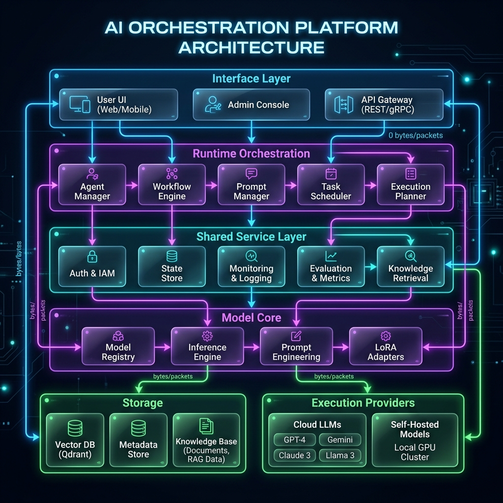

### 🧱 Three-Tier Modular System Layout:

1. **Multi-Interface Clients Layer**:

   * **PySide6 Desktop GUI**: A highly responsive, multi-threaded workspace executing long-running network operations via background worker threads to ensure zero main-loop freezing.
   * **Terminal CLI**: A lightweight, interactive command-line interface equipped with direct streaming, model hot-swapping, and metadata commands.
   * **Local API + SaaS Gateway**: Local OpenAI-compatible API traffic uses a bearer gate; SaaS traffic uses passport/BYOK tenant authentication and dynamic resource isolation. IDE extensions can target either gateway.
2. **Core Orchestration Chassis**:

   * Anchored by `ServiceRegistry`, `ConversationService`, `AuthService`, `RAGService`, `StorageService`, `CacheService`, `TelemetryManager`, and `CircuitBreaker`. The older `ConversationManager` remains as the desktop history compatibility path and still routes through the same storage-driver family.
3. **High-Concurrency Pluggable Storage Tier**:

   * **libSQL / Turso Edge Shards (Default)**: Leverages lightweight Hranas edge replication and database-per-tenant sharding to support zero-locking remote transactional operations.
   * **PostgreSQL Cluster Engine**: Offers enterprise-grade multi-process concurrency, implementing raw row-level locking and Multi-Version Concurrency Control (MVCC).
   * **Local SQLite / metadata fallback**: Preserves zero-config desktop history, SaaS user metadata, and local recovery flows with WAL enabled.
   * **Isolated Multi-Tenant Sandbox**: Enforces tenant isolation across auth, settings/BYOK credentials, history routing, vector collections, background jobs, and cache tables.

---

## 🧱 Tech Stack

                                                 

---

## ⚙️ Configuration & High-Concurrency Data Storage

This application does not use local `.env` files or plaintext config files for sensitive data.

To eliminate multi-process write-locking timeout crashes across simultaneous **GUI (Desktop)**, **CLI (Terminal)**, and **SaaS API (Port 5000)** connections, **SQLite has been 100% purged** from the primary engine. In its place, the application implements pluggable MVCC/cloud storage:

* **API Credentials:** Migrated away from plaintext. Securely injected into the OS vault subsystem using the Python `keyring` module (Windows Credential Manager / macOS Keychain).
* **UI Settings:** Layout preferences stored dynamically using `QSettings`.
  * **Portable Mode:** Saved to `settings.ini` in the application folder (zero system footprint).
  * **Standard/Custom Mode:* Saved securely via native OS configurations (Windows Registry, macOS plist, Linux conf).
* **Pluggable Storage Chassis**:
  * **Turso / libSQL (Default)**: Executes queries over Hranas transactions with edge-replicated cloud database-per-tenant sharding.
  * **PostgreSQL (Enterprise)**: Connects dynamically to remote/local PG clusters, implementing native row-level locks and MVCC.
* **Isolated Multi-Tenant Sandboxing**:
  Supports multiple concurrent registered users working in private "virtual sandboxes" (each acting like a separate virtual desktop app instance). Isolates history, metadata, and BYOK credentials via dynamic tenant sharded DB paths, isolated settings blocks, and JWT-authenticated session tokens.

---

## 🌐 Universal API Server

- Fully compatible with OpenAI-style API  `/v1/chat/completions` (used by IntelliJ plugin).
- Start from **Tools → Universal API Server** (✅ = running). Server runs on `http://localhost:5000`
- **Security & Key Management:** Manage your local API server in **Settings → Generation Parameters → API Credentials**. You can view, regenerate, or hard-disable your key (which securely shuts down the port). Changes in this tab are executed instantly with a live confirmation popup.

### Endpoints

| Endpoint                 | Method | Description                     |
| ------------------------ | ------ | ------------------------------- |
| `/health`              | GET    | Server status                   |
| `/v1/models`           | GET    | List model                      |
| `/v1/chat/completions` | POST   | OpenAI-compatible chat endpoint |

### VS Code Extension (V2.0.0)

Install `extension/vscode-llm-chat-2.0.0.vsix`:

1. VS Code Extensions (Ctrl+Shift+X)
2. Click "..." → "Install from VSIX..." and select the file.
3. Automatically prompts onboarding on load to configure dynamic server URL and secure passport keys.

### JetBrains Extension (V2.0.0)

Install `extension/jetbrains-llm-chat-2.0.0.zip`:

1. Open JetBrains IDE (IntelliJ, PyCharm, WebStorm, etc.) and go to Settings → Plugins.
2. Click the ⚙️ (gear) icon → "Install Plugin from Disk...".
3. Select the `.zip` file and restart the IDE.
4. Configure connection via IDE settings to connect to the Universal API Server.

### Other IDEs

Configure any OpenAI-compatible extension with:

- **URL:** `http://localhost:5000/v1`
- **API Key:** The dynamically generated token from your active session (viewable in Settings).

---

## 📋 Log System

The application features a comprehensive logging system for background operations:

- **Real-time Updates:** All fetch and generation progress appears instantly in the Log Viewer
- **Color-coded Levels:** INFO (green), SUCCESS (blue), WARNING (yellow), ERROR (red), DEBUG (purple)
- **Filterable:** Toggle specific log levels on/off
- **Persistent Storage:** Logs saved to `resources/update_log.txt` and survive app restarts
- **Background Operations:** Model fetching and description generation run without blocking the UI

---

## ⌨️ Keyboard Shortcuts

| **Key**                      | **Action**                                                  |
| :--------------------------------- | :---------------------------------------------------------------- |
| `Enter`                          | Send message                                                      |
| `Shift + Enter`                  | Insert new line                                                   |
| `F11`                            | Toggle true Fullscreen                                            |
| `Esc`                            | Exit true Fullscreen                                              |
| `Close button (X)` or `Alt+F4` | Shows exit options (Exit Application / Minimize to Tray / Cancel) |
| `Ctrl+Alt+S`                     | Toggle Universal API Server (if shortcut configured)              |
| `Ctrl+N`                         | New Conversation                                                  |
| `Ctrl+S`                         | Save Conversation                                                 |
| `Ctrl+L`                         | Load Conversation                                                 |
| `Ctrl+M`                         | Minimize to Tray                                                  |
| `Ctrl+Q`                         | Exit                                                              |
| `Ctrl+D`                         | Clear Chat                                                        |
| `Ctrl+Shift+C`                   | Copy Last Response                                                |

---

## 🤝 Contributing

Contributions, issues, and feature requests are highly welcome! Whether it's fixing a bug, improving the UI, or adding support for a new API, your help is appreciated.

To contribute:

1. **Fork** the Project
2. Create your **Feature Branch** (`git checkout -b feature/AmazingFeature`)
3. **Commit** your Changes (`git commit -m 'Add some AmazingFeature'`)
4. **Push** to the Branch (`git push origin feature/AmazingFeature`)
5. Open a **Pull Request**

**Guidelines:**

- Please follow standard Python [PEP 8](https://peps.python.org/pep-0008/) conventions.
- Keep the UI consistent with the current light/dark theme logic.
- If adding new API endpoints, ensure they are handled safely in the `logic/` folder without blocking the main UI thread.

---

## ⚠️ Disclaimer

This software is provided as-is, free of charge, for educational and personal use purposes.

- **AI Accuracy:** This application interfaces with third-party Large Language Models (LLMs). The developers of this application do not control, endorse, or guarantee the accuracy, completeness, or appropriateness of the AI-generated responses. AI models can produce incorrect, biased, or offensive content.
- **User Responsibility:** You are solely responsible for any prompts you submit and any outputs you rely on. Always verify critical information generated by AI.
- **API Usage:** This app interfaces with multiple third-party AI APIs (NVIDIA, Google, OpenAI, Ollama). You are responsible for managing your own API keys, adhering to NVIDIA's Terms of Service, and monitoring your own API usage limits and quotas.
- **No Liability:** The maintainers of this repository shall not be held liable for any damages, data loss, or issues arising from the use of this software.

---

## 🔨 Building from Source (Developer Guide)

If you want to build the distributable installers yourself, follow the OS-specific steps below.

*Note: You must build on the target OS (Windows builds for Windows, Mac builds for Mac, Linux builds for Linux).*

### Prerequisites

1. Install all core and build dependencies: `pip install -r requirements.txt`
2. Generate the required OS icon files from your source `resources/app_icon.png`:

   ```bash
   python -c "from PIL import Image; img = Image.open('resources/app_icon.png'); img.save('resources/app_icon.ico', sizes=[(16,16), (32,32), (48,48), (64,64), (128,128), (256,256)]); img.resize((256, 256)).save('resources/app_icon_linux.png'); print('Icons generated!')"
   ```

   *(Note: To generate the `.icns` for macOS, you must run `iconutil` on a Mac).*

### Step 1: Build the Executable (All OS)

Run this from the project root. The project includes three spec files for different build types:

```bash
# 1. Standard Builds (App Only)
pyinstaller LLM_Chat_App_onedir.spec
pyinstaller LLM_Chat_App_onefile.spec
pyinstaller LLM_Chat_App_mac.spec

# 2. Full Suite Builds (App + Operator Tools)
pyinstaller LLM_Chat_App_onedir_full.spec
pyinstaller LLM_Chat_App_onefile_full.spec
pyinstaller LLM_Chat_App_mac_full.spec
```

**Build outputs:**

- One-dir: `dist/LLM_Chat_dir/` (folder containing the executable and all dependencies)
- One-file: `dist/LLM_Chat_one_file/LLM Chat App.exe` (single executable file)
- Full builds will simultaneously compile `Migration Companion` and `Reset Admin` into `dist/`.
- On first launch, the executable checks directory permissions. If running from a restricted system folder (like `C:\Program Files`), it automatically creates data resources inside `AppData` to ensure zero-crash operation.
- If run from a writable folder (USB drive/Desktop), it prompts the user to select between **Portable**, **Standard**, or **Custom** storage paths.
- Uses **Smart Sync** to safely unpack current UI versions to the active Data Root without wiping user configs.

**Test the executable** before proceeding to package it!

### Step 2: Create the OS Installer

#### 🪟 Windows (Inno Setup)

1. Download and install [Inno Setup](https://jrsoftware.org/isdl.php).
2. Place `installer_script.iss` in the project root folder.
3. Open the `installer_script.iss` file in Inno Setup.
4. Go to **Build > Compile** (or press `Ctrl+F9`).
5. *Output:* `installer_output/LLM_Chat_App_Setup_v8.0.0.exe`

The installer copies the entire `dist/LLM_Chat_dir/` folder to `Program Files` and creates desktop/start menu shortcuts.

#### 🐧 Linux (DEB & AppImage)

For Ubuntu/Debian, use the automated build scripts:

**1. Create a DEB Installer:**

```bash
# Build onedir first
pyinstaller LLM_Chat_App_onedir.spec
# Run the automation script
bash build_deb.sh
# Install
sudo dpkg -i llmchatapp_8.0.0.deb
```

**2. Create a Portable AppImage:**

```bash
# Build onedir first
pyinstaller LLM_Chat_App_onedir.spec
# Run the AppImage script
bash build_appimage.sh
```

Uninstall DEB: `sudo apt remove llmchatapp`

#### 🍎 macOS (PKG)

For macOS (Intel & Apple Silicon M1/M2/M3/M4), use the automated build script:

```bash
# Build mac bundle first
pyinstaller LLM_Chat_App_mac.spec
# Run the automation script
bash build_mac.sh
```

The compiled app leverages a dynamic configuration manager on the first boot to determine file locations:

1. **Standard Mode:** Installs configurations to the standard secure User Home location (e.g., `~\LLMChatApp`). Perfect for standard installations.
2. **Truly Portable Mode:** Packs absolutely every single byte—including SQL databases, caches, and even the settings files—into the same folder as the `.exe`. Safe for thumb drives.
3. **Custom Mode:** Routes all data folders to a network drive or synchronized folder of the user's choosing (e.g., Dropbox/OneDrive).

Regardless of selection, the target root directory will structure itself like this:

- `/conversations/` - SQLite database `chat_history.db`
- `/vector_db/` - Local persistent semantic vector databases (Qdrant)
- `/resources/` - Extracted styling and JSON manifests
- `/resources/badge_cache/` - Dynamic cached images
- `/ui_designer/` - Extracted interface schemas
- `/resources/update_log.txt` - Global application log file

---

## 👨‍💻 About the Team & Credits

This framework is architected and curated with the vision of building transparent, universal gates into advanced AI technologies.

* **Lead Architect:** **Arean Narrayan** ([@Arean82](https://github.com/Arean82))
* **Design Ethos:** Deliver highly secure, agnostic interfaces free of platform bias or maintenance decay.

---

## 📅 Change Log

### v8.0.0 – Standalone Migration Companion App & Operator Admin Portfolio

* **Standalone Migration Companion**: Created `operator_tools/migration_companion.py` — a dual-mode (PySide6 GUI + Headless CLI) database relocator for safely migrating SaaS tenant data between Turso/libSQL and PostgreSQL/MySQL clusters.
* **Glassmorphic Migration Wizard**: GUI mode features a GitHub-dark themed wizard with real-time progress bars, step indicators, and scrolling log consoles powered by background `QThread` workers.
* **Jaccard Similarity Integrity Audits**: Post-relocation verification compares row counts across all 6 tenant tables with formatted ASCII summary tables and a computed Jaccard Similarity Index.
* **Settings Menu Subprocess Forking**: Added `🔄 Database Relocator` to the desktop Settings menu. Triggers auto-save, gracefully shuts down the main app to release database locks, then launches the companion as a detached subprocess.
* **Isolated Operator Admin Portfolio**: All administrative scripts relocated to `operator_tools/`. The legacy `scripts/reset_admin.py` is deprecated and redirects to the canonical version.
* **Triple PyInstaller Bundling**: Restructured `LLM_Chat_App_combined.spec` to compile three distinct binaries: `LLM Chat App.exe` (public), `Migration Companion.exe` (private), and `Reset Admin.exe` (private).
* **Service-Friendly Pathing**: All operator tools use `sys.executable` parent resolution for frozen builds, ensuring correct operation when mounted as Windows Services or systemd daemons.

### v7.3.0 – Secure Multi-Tenant Data Relocation & Standalone Migration Suite

* **Desktop Geometry Persistence:** All major PySide6 dialogs (Credential Manager, Model Selector, Log Viewer, SaaS Settings) now leverage OS-native `QSettings` to memorize exact window coordinates and dimensions across app restarts.
* **Universal Provider Architecture:** Stripped hardcoded provider lock-ins (NVIDIA, Meta fallbacks) from the backend API router, enforcing dynamic agnostic compatibility.
* **SaaS Documentation Suite:** Introduced an isolated SaaS documentation environment (`saas/saas_docs/`) heavily segmented via Role-Based Access Control (Admin vs Tenant constraints).
* **Web Native Markdown Rendering:** Implemented a lightweight client-side markdown viewer utilizing `marked.js` within the SaaS web portal to render technical documentation seamlessly without external Node.js dependencies.
* **L2 Chunk Cache Engine:** Embedded SHA-256 deduplication for dense document vectors preventing repeat local API inference loops during text chunk ingestion.
* **L3 Semantic Query Cache:** Integrated instantaneous response cache bypassing LLM completions engines for identical multi-tenant workspace user queries.
* **Migration Indexing Ready:** Expanded caching ledger inside `tenant_db.py` to enforce strict standard SQLite indexes matching PostgreSQL scaling paradigms.

### v7.1.0 – Windows Taskbar Icon & Wide-String AppUserModelID Stabilization

* **Windows ctypes unicode translation**: Solved a crucial C-level bug where `SetCurrentProcessExplicitAppUserModelID` received garbage ANSI string pointers, successfully forcing wide-string `c_wchar_p` interpretation.
* **Master App ID Consolidation**: Removed conflicting duplicate calls inside the UI main window shell, centralizing startup registration as a single source of truth.
* **Bypassed Windows Icon Cache**: Migrated taskbar grouping variables to a fresh ID (`arean82.llmchatapp.v8.0`) to instantly force the Windows shell to clear generic icon associations and display the custom app icon.

### v7.0.0 – Headless SaaS Platform & Cloud Multi-Tenancy Architecture

* **SaaS Gateway Web Portal**: Re-architected engine to natively host a scalable Flask/HTML/JS web dashboard mimicking the desktop GUI perfectly via browser.
* **1:1 Native Visual Parity**: Mirrored strict QDialog layouts, physical folder-tab structures, Active Provider logics, and dynamic Developer groupings to the web interface.
* **Pluggable High-Concurrency Backend**: Decoupled SQLite to support fully scalable multi-tenant Postgres and Turso edge deployments for zero-locking database architectures.
* **Master System Synergy**: The desktop now serves as an administrative host console managing remote tenant lifecycles, global active SDK keys, and telemetry metrics while the local application runs undisturbed.

### v6.7.0 – Pluggable Two-Stage Reranking Pipeline & Modern Tabbed UI

- 🎛️ **Modern Tabbed Settings UI**: Restructured the generation settings dialog into a premium `QTabWidget` containing "Model Parameters" and "Retrieval Reranking" tabs. Injected customizable stylesheets matching active Dark/Light system preferences.
- 📐 **Symmetrical Size Normalization**: Constrained the dialog bounding dimensions to a sleek `500x480` profile across all layout and initialization threads to eliminate vertical gaps and visual stretching.
- 🧠 **Dynamic Two-Stage Reranking Pipeline**: High-precision semantic ranking supporting local BGE Cross-Encoder ONNX execution (with lexical Jaccard fallback), cloud Cohere Rerank v3 API, or custom OpenAPI-compatible endpoints.
- ⚙️ **Hybrid A Structural Bias**: Automatically boosts similarity scoring by 20% (`score * 1.2`) for context chunks containing code structural declarations (`class `, `def `, `interface `, `function `) to keep system blueprints highly prioritized.
- 🎨 **Hybrid B Diversity MMR**: Prunes redundant context chunks sharing high token overlap (Jaccard similarity threshold `> 0.5`) to prevent repeating the same source code fragments within the prompt.
- 📡 **Interactive Visual Diagnostics**: Streams step-by-step thinking diagnostics detailing precise pipeline execution steps, scoring engines, boosts, and prunings.

### v6.6.0 – Multi-Engine Cloud Concurrency & Isolated Multi-Tenant Sandbox

- 🗃️ **Complete Purge of SQLite**: Entirely eliminated local SQLite write-locking bottlenecks and database timeout crashes, guaranteeing zero-locking concurrent operations across GUI, CLI, and Headless sessions.
- ☁️ **Pluggable Cloud Engines (Turso & PostgreSQL)**: Integrated abstract `BaseStorageDriver` mapping to highly concurrent cloud sharded databases:
  - *Turso / libSQL*: Supports synchronous Hranas edge replication.
  - *PostgreSQL*: Incorporates native row-level locking, MVCC parameters escaping, and atomic serial key retrieval (`RETURNING id`).
- 🌁 **Live Database Relocation Bridge (CLI)**: Developed an interactive database-to-database live history copy engine (`python main.py --migrate`) supporting non-destructive transfers between Turso and PostgreSQL.
- 🛡️ **Isolated Multi-Tenant Sandboxing Specs**: Formulated Phase 4 scaling architectural plans, establishing isolated user "virtual sandboxes" partitioned via dynamic sharded tenant DB paths (`{tenant_id}`), dedicated per-user credentials blocks, and cryptographically signed JWT session tokens.
- 🏛️ **Live Mermaid Architecture-as-Code**: Replaced static binary diagrams with an interactive, plain-text Mermaid visual graph directly inside repository documentation, ensuring absolute maintainability and consistency.

### v6.5.0 – Headless Engine, Decoupled Registries, & Display-Safe Auto-Detection

- 🖥️ **Headless CLI Support & Auto-Detection**: Introduced a full-featured headless engine for server-side and terminal-only operations. Features 100% automatic platform, display, SSH terminal, and TTY environment identification.
- 🛡️ **Display-Safe No-Crash Fallback**: Integrated a safe-guard trap for GUI initialization. If running on headless servers, Remote SSH, or Docker without graphics display libraries, the system automatically catches PySide connection failures and falls back to Headless mode smoothly instead of crashing.
- 🔗 **Decoupled Unified JSON Registry**: Fully decoupled both the GUI (`ui/credential_manager.py`) and CLI (`headless/auth.py`) provider catalog structures. Both interfaces now dynamically parse and load Platforms and Ecosystems from the centralized `resources/api_providers.json` config, supporting 16 individual SDK groups and 22 ecosystems out-of-the-box.
- 🐛 **Combo-Box Lifecycle Patch**: Fixed a PySide index race condition where settings dialog default loads failed to trigger dependent ecosystem updates, ensuring correct field populations on launch.
- 🛡️ **Stable Foundation Rebuild**: Purged legacy regressions and consolidated the codebase onto the high-performance v6.5 chassis.

### v6.1.0 – High-Performance Hybrid Memory & Centralized Authentication

- 🔐 **Centralized Credential Hub**: Unified management of all API keys, URLs, and ecosystems into a single tabbed interface.
- 🛡️ **Secure "Set Live" Transition**: Implemented mandatory logout confirmation gate for ecosystem switches to protect session integrity.
- 🔄 **Smart Discovery Pipeline**: Overhauled "Fetch Models" logic with ecosystem-aware background workers and security-gate filtering.
- ✨ **Premium 4K Visual Identity**: Replaced all legacy placeholders with a high-fidelity glassmorphism icon suite for Windows, macOS, and Linux.
- 🧬 **Hybrid RAG Persistence**: Fused rapid NumPy crawling with Qdrant local vector stores for deep, enterprise-grade persistent semantic recollection.
- 🛠️ **Interactive Execution Sandbox**: Integrated isolated, async process forks (`QProcess`) to dynamically compile and run Python/PySide prototypes inline.
- 🪄 **Vision-to-Sandbox Hook**: Automatic base64 visual parsing pipeline enables immediate functional sandboxing directly from image mockup prompt requests.
- ⚡ **Async Zero-Config Sweep**: Non-blocking startup daemon probes local localhost ports automatically, mapping Ollama and LM Studio catalogs instantly.
- 🎨 **Dynamic High-Contrast Accessible UI**: Programmatic `QPalette` injection guaranteeing readable placeholder texts and input layouts across both light and dark themes.

### v6.0.0 – Universal Orchestration & Context Evolution

- 🚀 **Adaptive Memory Compression**: Seamless background context synthesis unlocking infinite conversation depths.
- ⚔️ **AI Model Arena**: Inaugural dual-concurrent comparison engine for competitive LLM benchmarking.
- 🌍 **Universal Ecosystem Grid**: Formalized native integrations for Google, Groq, Ollama, and LM Studio.
- 🔐 **Segmented Vault**: Advanced OS-level credential isolation protecting independent provider keys.
- 📦 **Transactional Storage**: Introduced hot-swappable runtime path management for user data relocation.
- ✨ **System UI Overhaul**: Migrated monolith view to High-Velocity Modular Stack for optimized memory cycles.

### v5.0.0 – Modern Infrastructure Foundations

- 💾 **SQLite Persistence Core**: Heavy-duty transactional chat logging with WAL-mode safety locks.
- 🤖 **Dynamic Catalog Expansion**: Replaced static indices with segmented runtime ecosystem JSON catalogs.
- 🌐 **Flask API Architecture**: Introduction of the background-threading local gateway for IDE bridges.
- 🔧 **Smart Model Tuning**: Precision UI handlers added for manual Temperature and Token-Limit overrides.
- 📡 **Extension Ecosystem V1**: Official stable launch of packaged VSCode and JetBrains connectivity clients.

### v4.0.0 – Framework Maturation

- 📜 **Library Interface**: Deployed the persistent instruction repository and system-prompt configurator.
- 📋 **Active Log Inspector**: Real-time event loop monitoring specifically for ecosystem fetches.
- ⚙️ **Model Manager V1**: Basic graphical table added for provider addition/removal management.
- 🚀 **Streaming Refinement**: Optimized real-time token stream deserialization to eliminate jitter lag.

---

## 📝 License

This project is licensed under the MIT License - see the [LICENSE](LICENSE) file for details.
