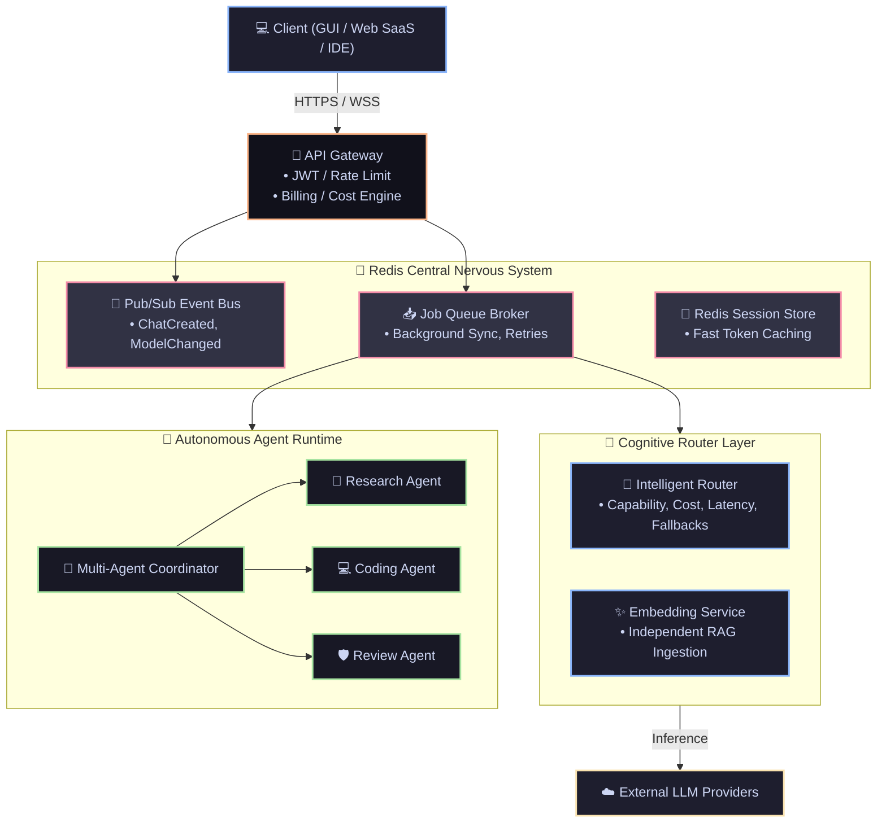

# Working Plan: Attaining v9.0 Enterprise (Master Progress Log)

This is the tactical manual for evolving the **v8.0 Monolithic SaaS architecture** into the **v9.0 Distributed Micro-Agent Enterprise Ecosystem**.

---

## 🌌 Complete Distributed System Architecture

This diagram governs the flow of the new Redis-backed, event-driven multi-agent architecture:

### 🛡️ The "Thick Client" Admin Fallback Strategy
While V9 operates primarily as a headless, distributed cloud service for end-users, **the PySide6 standalone GUI will NOT be deleted.** Instead, it is being structurally repurposed as the **Admin Operations Control Panel**. 
* **Role**: It serves as a direct-access, heavy-duty "backup" interface for the SaaS administrator.
* **Function**: If the API Gateway or Web Dashboard goes down, the Admin can launch the native GUI to securely bypass the gateway, directly access the local OS Keyring, manually manage the Redis queues, and perform emergency database migrations.

---

## 🔴 Phase 1: The Redis Message Broker & Infrastructure Overlay [STATUS: PLANNED]

Phase 1 establishes Redis as the central nervous system of the application, decoupling the GUI, IDE plugins, and SaaS web server so they can communicate asynchronously.

### 1.1 Redis Foundation & Event Bus

| #                | Task                                                                                                                                                                                                 | Status           |
| :--------------- | :--------------------------------------------------------------------------------------------------------------------------------------------------------------------------------------------------- | :--------------- |
| **1.1.1** | **Redis Client Interfacing**: Implement a thread-safe Redis connection pool inside `core/redis_manager.py` with graceful fallbacks (or hard failures if we enforce Redis).                          | 📝**PLANNED** |
| **1.1.2** | **Event Bus Abstraction**: Build `core/event_bus.py` implementing `publish()` and `subscribe()` wrappers over Redis Pub/Sub.                                                                         | 📝**PLANNED** |
| **1.1.3** | **ServiceRegistry Deprecation**: Systematically replace synchronous `ServiceRegistry` singleton calls with Event Bus payloads (e.g., `ChatCreated`, `ModelChanged`, `ConfigUpdated`).               | 📝**PLANNED** |
| **1.1.4** | **Cross-Process Sync**: Bind the PySide6 UI Event Loop to the Redis Event Bus so that SaaS API hits immediately trigger visual redraws in the native desktop app.                                      | 📝**PLANNED** |

---

## 🔴 Phase 2: Distributed Job Queueing & Asynchronous Workers [STATUS: PLANNED]

Phase 2 replaces the in-memory threading queues with a durable Redis Queue, paving the way for distributed multi-server processing (Celery).

### 2.1 Redis Queue Broker

| #                | Task                                                                                                                                                                                                     | Status           |
| :--------------- | :------------------------------------------------------------------------------------------------------------------------------------------------------------------------------------------------------- | :--------------- |
| **2.1.1** | **Queue Broker Engine**: Abstract `JobQueueEngine` into a `RedisQueueBroker` to push tasks (Embeddings, indexing) to Redis lists.                                                                       | 📝**PLANNED** |
| **2.1.2** | **Background Workers**: Create isolated Python worker processes that listen to the Redis queue and process tasks independently of the main GUI/API threads.                                               | 📝**PLANNED** |
| **2.1.3** | **Dead Letter Queue (DLQ)**: Implement retry limits. Failed tasks (e.g. LLM timeout) are moved to a DLQ for manual inspection or exponential backoff retries.                                           | 📝**PLANNED** |

---

## 🔴 Phase 3: Cognitive Routing & API Gateway Integration [STATUS: PLANNED]

Phase 3 introduces advanced enterprise API management and intelligent LLM routing.

### 3.1 API Gateway & Security

| #                | Task                                                                                                                                                                            | Status           |
| :--------------- | :------------------------------------------------------------------------------------------------------------------------------------------------------------------------------ | :--------------- |
| **3.1.1** | **API Gateway Pipeline**: Inject a middleware Gateway before hitting Flask. Implement JWT validation, global Rate Limiting, and API versioning.                                | 📝**PLANNED** |
| **3.1.2** | **Security Service Separation**: Isolate Auth from core logic. Implement an independent `SecurityService` handling RBAC, Audit Logging, and Secret Key rotation.                 | 📝**PLANNED** |

### 3.2 Model Router Layer

| #                | Task                                                                                                                                                                                  | Status           |
| :--------------- | :------------------------------------------------------------------------------------------------------------------------------------------------------------------------------------ | :--------------- |
| **3.2.1** | **Capability Routing**: Build `ModelRouter` to intercept requests. Automatically route `task=="code"` to Claude/Llama and `task=="vision"` to Gemini/GPT-4V.                         | 📝**PLANNED** |
| **3.2.2** | **Failover & Latency Routing**: Implement provider health-checks. If a cloud API throws a 500/429, instantly failover to a designated local fallback model.                            | 📝**PLANNED** |
| **3.2.3** | **Cost Engine Initialization**: Build `CostEngine` to track Token Usage * Provider Cost per token, applying quotas and SaaS billing ledgers before granting inference permission.       | 📝**PLANNED** |

---

## 🔴 Phase 4: Distributed Memory Architecture [STATUS: PLANNED]

Phase 4 breaks down the monolithic RAG pipeline into distinct memory and embedding micro-services.

### 4.1 Memory Service Layer

| #                | Task                                                                                                                                                                                        | Status           |
| :--------------- | :------------------------------------------------------------------------------------------------------------------------------------------------------------------------------------------ | :--------------- |
| **4.1.1** | **Redis Session Store**: Implement `ShortTermMemory` using Redis TTLs for lightning-fast active conversation context retrieval.                                                             | 📝**PLANNED** |
| **4.1.2** | **Embedding Service Decoupling**: Rip embeddings out of the RAG flow into a standalone `EmbeddingService` that caches BGE/OpenAI vectors directly to Qdrant without UI dependencies.          | 📝**PLANNED** |
| **4.1.3** | **Compression Engine**: Deploy a background worker that monitors Redis Session Memory. When a session exceeds 80% context window, it automatically summarizes and flushes to `LongTermMemory`. | 📝**PLANNED** |

---

## 🔴 Phase 5: Autonomous Multi-Agent Runtime [STATUS: PLANNED]

Phase 5 introduces pure Agentic autonomy, utilizing the queues and event buses to orchestrate self-prompting AI loops.

### 5.1 Agent Runtime & Coordinator

| #                | Task                                                                                                                                                                              | Status           |
| :--------------- | :-------------------------------------------------------------------------------------------------------------------------------------------------------------------------------- | :--------------- |
| **5.1.1** | **Agent Runtime Core**: Implement `AgentRuntime` containing a `Planner`, `ToolExecutor`, and `Sandbox` execution environment.                                                   | 📝**PLANNED** |
| **5.1.2** | **Multi-Agent Coordinator**: Build a master coordinator node that can spawn sub-agents (Research Agent, Coding Agent) and aggregate their results into a final output pipeline.      | 📝**PLANNED** |
| **5.1.3** | **Workflow Engine**: Introduce deterministic prompt chains and conditional loops (e.g., Upload -> Extract -> Embed -> Summarize).                                               | 📝**PLANNED** |

---

## 🔴 Phase 6: Enterprise Observability & Feature Store [STATUS: PLANNED]

Phase 6 hardens the ecosystem for production enterprise deployments.

### 6.1 Feature Store & Telemetry

| #                | Task                                                                                                                                                                                              | Status           |
| :--------------- | :------------------------------------------------------------------------------------------------------------------------------------------------------------------------------------------------ | :--------------- |
| **6.1.1** | **Feature Flags Database**: Implement `FeatureStore` (`enable_agents`, `beta_features`) to allow hot-swapping SaaS features dynamically without restarting the server.                             | 📝**PLANNED** |
| **6.1.2** | **OpenTelemetry Upgrades**: Replace local `TelemetryManager` with OpenTelemetry tracing, exposing `/metrics` endpoints for Prometheus and Grafana dashboards tracking Redis queue health.           | 📝**PLANNED** |
| **6.1.3** | **Repository Pattern Isolation**: Completely decouple business logic from underlying storage drivers to guarantee unit testability and effortless future DB migrations.                             | 📝**PLANNED** |
