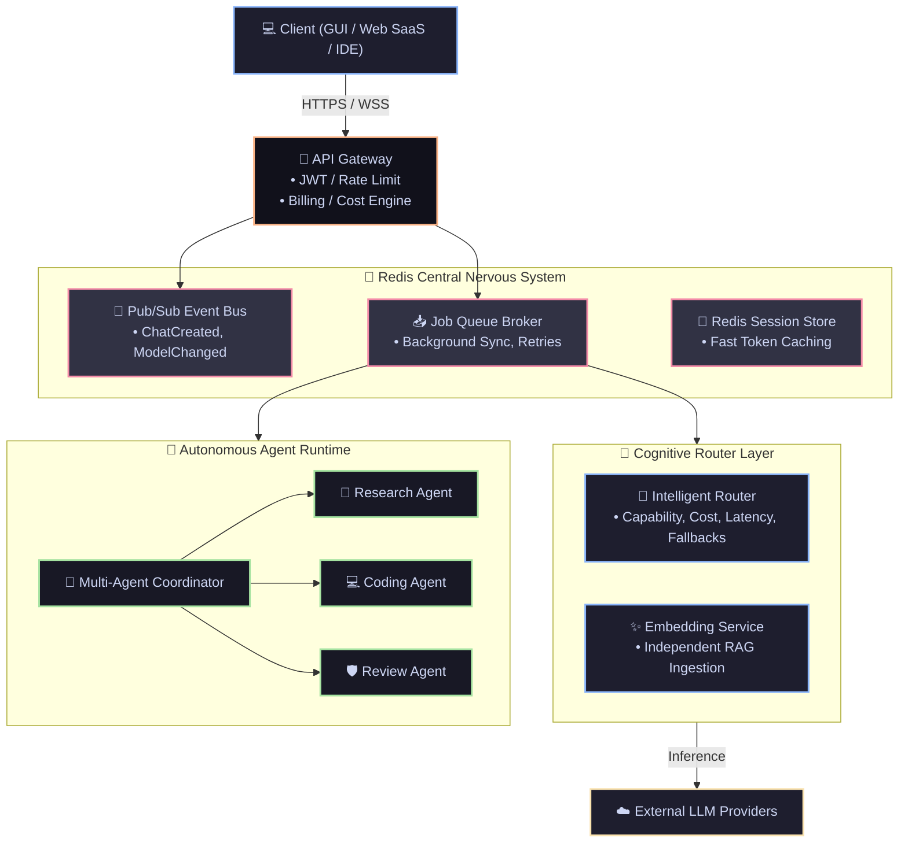

# Working Plan: Attaining v9.0 Enterprise (Master Progress Log)

This is the tactical manual for evolving the **v8.0 Monolithic SaaS architecture** into the **v9.0 Distributed Micro-Agent Enterprise Ecosystem**.

---

## 🌌 Complete Distributed System Architecture

This diagram governs the flow of the new Redis-backed, event-driven multi-agent architecture:



### 🛡️ The "Thick Client" Admin Fallback Strategy

While V9 operates primarily as a headless, distributed cloud service for end-users, **the PySide6 standalone GUI will NOT be deleted.** Instead, it is being structurally repurposed as the **Admin Operations Control Panel**.

* **Role**: It serves as a direct-access, heavy-duty "backup" interface for the SaaS administrator.
* **Function**: If the API Gateway or Web Dashboard goes down, the Admin can launch the native GUI to securely bypass the gateway, directly access the local OS Keyring, manually manage the Redis queues, and perform emergency database migrations.
* **Remote Mission Control**: The GUI can be run locally on the administrator's desktop, utilizing secure SSH Tunnels/VPNs to connect remotely to the Redis Event Bus and PostgreSQL databases running headless on the Oracle Cloud infrastructure. This provides a unified "Mission Control" without tying the administrator to the server's command line.

### 🔄 The V9 Deployment Lifecycle (Turso Bootstrap)

To ensure a frictionless, zero-configuration installation out-of-the-box, the V9 architecture will follow a staged database lifecycle:

1. **Bootstrap Phase**: Fresh installations default entirely to **Turso / libSQL** (embedded local SQLite). This allows the application to start instantly without requiring a complex PostgreSQL cluster setup.
2. **Enterprise Migration**: Once the server administrator is ready to scale up to production, they launch the `operator_tools/migration_companion.py` to seamlessly migrate all Turso data into their enterprise **PostgreSQL (pg)** cluster.

---

## 🟢 Phase 1: The Redis Message Broker & Infrastructure Overlay [STATUS: COMPLETED]

Phase 1 establishes Redis as the central nervous system of the application, decoupling the GUI, IDE plugins, and SaaS web server so they can communicate asynchronously.

### 1.1 Redis Foundation & Event Bus

| #               | Task                                                                                                                                                                                                                | Status           |
| :-------------- | :------------------------------------------------------------------------------------------------------------------------------------------------------------------------------------------------------------------ | :--------------- |
| **1.1.1** | **Redis Client Interfacing**: Implement a thread-safe Redis connection pool inside `core/redis_manager.py` with graceful fallbacks (or hard failures if we enforce Redis).                                  | ✅**DONE** |
| **1.1.2** | **Event Bus Abstraction**: Build `core/event_bus.py` implementing `publish()` and `subscribe()` wrappers over Redis Pub/Sub.                                                                            | ✅**DONE** |
| **1.1.3** | **ServiceRegistry Deprecation**: Systematically replace synchronous `ServiceRegistry` singleton calls with Event Bus payloads (e.g., `ChatCreated`, `ModelChanged`, `ConfigUpdated`).                 | ✅**DONE** |
| **1.1.4** | **Cross-Process Sync**: Bind the PySide6 UI Event Loop to the Redis Event Bus so that SaaS API hits immediately trigger visual redraws in the native desktop app.                                             | ✅**DONE** |
| **1.1.5** | **Remote Mission Control Configurator**: Upgrade GUI settings to accept dynamic remote IP bindings for Redis and DBs (instead of `localhost`), enabling the local thick-client to manage the cloud backend. | ✅**DONE** |

---

## 🟢 Phase 2: Distributed Job Queueing & Asynchronous Workers [STATUS: COMPLETED]

Phase 2 replaces the in-memory threading queues with a durable Redis Queue, paving the way for distributed multi-server processing (Celery).

### 2.1 Redis Queue Broker

| #               | Task                                                                                                                                                                | Status           |
| :-------------- | :------------------------------------------------------------------------------------------------------------------------------------------------------------------ | :--------------- |
| **2.1.1** | **Queue Broker Engine**: Abstract `JobQueueEngine` into a `RedisQueueBroker` to push tasks (Embeddings, indexing) to Redis lists.                         | ✅**DONE** |
| **2.1.2** | **Background Workers**: Create isolated Python worker processes that listen to the Redis queue and process tasks independently of the main GUI/API threads.   | ✅**DONE** |
| **2.1.3** | **Dead Letter Queue (DLQ)**: Implement retry limits. Failed tasks (e.g. LLM timeout) are moved to a DLQ for manual inspection or exponential backoff retries. | ✅**DONE** |

---

## 🟢 Phase 3: Cognitive Routing & API Gateway Integration [STATUS: COMPLETED]

Phase 3 introduces advanced enterprise API management and intelligent LLM routing.

### 3.1 API Gateway Sub-Components

| #                 | Task                                                                                                                                              | Status           |
| :---------------- | :------------------------------------------------------------------------------------------------------------------------------------------------ | :--------------- |
| **3.1.1.a** | **JWT Authentication Filter**: Inject middleware to block any unauthorized external SaaS API hits before they reach the main LLM endpoints. | ✅**DONE** |
| **3.1.1.b** | **Global Rate Limiting Layer**: Implement a token-bucket algorithm using Redis to throttle excessive API queries from a single tenant IP.   | ✅**DONE** |
| **3.1.1.c** | **API Route Versioning**: Prefix all REST endpoints with `/v1/` and `/v2/` to ensure reverse compatibility for IDE integrations.        | ✅**DONE** |
| **3.1.2.a** | **SecurityService Isolation**: Completely decouple RBAC logic, Role matrices, and audit logging out of the core application router.         | ✅**DONE** |

### 3.2 Cognitive Model Router & Cost Sub-Components

| #                 | Task                                                                                                                                                                                                                                              | Status           |
| :---------------- | :------------------------------------------------------------------------------------------------------------------------------------------------------------------------------------------------------------------------------------------------ | :--------------- |
| **3.2.1.a** | **Capability Mapping Engine**: Build `ModelRouter` to automatically intercept and map logic (e.g., `task=="code"` routes to Claude/Llama).                                                                                              | ✅**DONE** |
| **3.2.2.a** | **Health-Check Aggregator**: Ping cloud APIs (Groq/OpenAI) asynchronously to track uptime states.                                                                                                                                           | ✅**DONE** |
| **3.2.2.b** | **Failover Routing Topology**: If a cloud API throws a 500/429, seamlessly fail over dynamically amongst the tenant's own registered BYOK keys (strictly preventing key bleeding and local connection retries unless explicitly configured) | ✅**DONE** |
| **3.2.3.a** | **Token Usage Ledger**: Write interceptors to log exact prompt/completion token usage to the Tenant's PostgreSQL database table.                                                                                                            | ✅**DONE** |
| **3.2.3.b** | **Billing Quota Enforcer**: Build a pre-flight check in the Cost Engine that rejects inference requests if the Tenant's token quota is zero.                                                                                                | ✅**DONE** |

---

## 🟢 Phase 4: Distributed Memory Architecture [STATUS: COMPLETED]

Phase 4 breaks down the monolithic RAG pipeline into distinct memory and embedding micro-services.

### 4.1 Memory Service Layer

| #               | Task                                                                                                                                                                                                   | Status           |
| :-------------- | :----------------------------------------------------------------------------------------------------------------------------------------------------------------------------------------------------- | :--------------- |
| **4.1.1** | **Redis Session Store**: Implement `ShortTermMemory` using Redis TTLs for lightning-fast active conversation context retrieval.                                                                | ✅**DONE** |
| **4.1.2** | **Embedding Service Decoupling**: Rip embeddings out of the RAG flow into a standalone `EmbeddingService` that caches BGE/OpenAI vectors directly to Qdrant without UI dependencies.           | ✅**DONE** |
| **4.1.3** | **Compression Engine**: Deploy a background worker that monitors Redis Session Memory. When a session exceeds 80% context window, it automatically summarizes and flushes to `LongTermMemory`. | ✅**DONE** |

---

## 🟡 Phase 5: Autonomous Multi-Agent Runtime [STATUS: IN PROGRESS]

Phase 5 introduces pure Agentic autonomy, utilizing the queues and event buses to orchestrate self-prompting AI loops.

### 5.1 Agent Runtime Environments

| #               | Task                                                                                                                                         | Status           |
| :-------------- | :------------------------------------------------------------------------------------------------------------------------------------------- | :--------------- |
| **5.1.a** | **The Logic Planner Module**: Implement an abstract planner class that breaks a complex user prompt into a sequential execution graph. | ✅**DONE** |
| **5.1.b** | **Tool Execution Sandbox**: Implement a strict python `subprocess` sandbox where agents can write and execute code in isolation.     | ✅**DONE** |
| **5.1.c** | **Redis Agent State Store**: Ensure agent memory and variables are cached in Redis so agents can pause and resume mid-workflow.        | ✅**DONE** |

### 5.2 Multi-Agent Coordinator Swarm

| #               | Task                                                                                                                                        | Status           |
| :-------------- | :------------------------------------------------------------------------------------------------------------------------------------------ | :--------------- |
| **5.2.a** | **Research Agent Implementation**: Specialized agent equipped with web-search tools and summarization chains.                         | ✅**DONE** |
| **5.2.b** | **Coding Agent Implementation**: Specialized agent with read/write access to the local sandbox file system and shell execution tools. | ✅**DONE** |
| **5.2.c** | **Review Agent Implementation**: Specialized agent to critique code and pass failures back to the Coding Agent in a closed-loop.      | ✅**DONE** |
| **5.2.d** | **Deterministic Workflow Engine**: Construct predefined prompt chains (e.g. `Upload -> Extract -> Embed -> Summarize -> Store`).    | ✅**DONE** |

---

## 🟢 Phase 6: Enterprise Observability & Feature Store [STATUS: COMPLETED]

Phase 6 hardens the ecosystem for production enterprise deployments.

### 6.1 Feature Store & Telemetry

| #               | Task                                                                                                                                                                                                | Status              |
| :-------------- | :-------------------------------------------------------------------------------------------------------------------------------------------------------------------------------------------------- | :------------------ |
| **6.1.1** | **Feature Flags Database**: Implement `FeatureStore` (`enable_agents`, `beta_features`) to allow hot-swapping SaaS features dynamically without restarting the server.                  | ✅**DONE** |
| **6.1.2** | **OpenTelemetry Upgrades**: Replace local `TelemetryManager` with OpenTelemetry tracing, exposing `/metrics` endpoints for Prometheus and Grafana dashboards tracking Redis queue health. | ✅**DONE** |
| **6.1.3** | **Repository Pattern Isolation**: Completely decouple business logic from underlying storage drivers to guarantee unit testability and effortless future DB migrations.                       | ✅**DONE** |

---

## 🟢 Phase 7: Remote Admin "Mission Control" Configuration [STATUS: COMPLETED]

Phase 7 formalizes the repurposing of the PySide6 standalone GUI into a dedicated remote operations dashboard.

### 7.1 Native PuTTY Integration & GUI Fallback

| #                 | Task                                                                                                                                                                                                               | Status              |
| :---------------- | :----------------------------------------------------------------------------------------------------------------------------------------------------------------------------------------------------------------- | :------------------ |
| **7.1.1**   | **Headless Strict Bypass Verification**: Ensure absolute separation in `main.py` so that `--headless` or `--cli` guarantees zero Qt graphical elements load in memory on the cloud server.             | ✅**DONE** |
| **7.1.2.a** | **Paramiko Native Integration**: Implement `HybridSSHTunnel` exposing a full `paramiko.SSHClient` for remote God Mode command execution and SFTP transfers across all operating systems.                                      | ✅**DONE** |
| **7.1.2.b** | **Secure Port Forwarding**: Utilize `sshtunnel` to forward remote Postgres (5432), Redis (6379), and God Mode API (Remote 5000 -> Local 5050). **Port 5050** acts as the highly restricted, secured, and encrypted tunnel for God Mode, leaving **Port 5000** strictly untouched for VSCode/JetBrains extensions.  | ✅**DONE** |
| **7.1.2.c** | **OS-Aware Subprocess Fallback**: Implement dynamic fallback logic to silently spawn `plink.exe` on Windows or native `ssh` on macOS/Linux in the background if Python C-extensions fail.                                    | ✅**DONE** |
| **7.1.3**   | **Operator Tools Retention**: Retain `operator_tools` inside the V9 suite strictly as a post-installation service wrapper and database connection configurator for the Admin.                              | ✅**DONE** |

---

## 🟢 Phase 8: Data Migration & Deployment Lifecycle [STATUS: COMPLETED]

Phase 8 implements the staged installation pipeline from local bootstrap to enterprise scale.

### 8.1 Configuration & Turso Bootstrap

| #               | Task                                                                                                                                                                                                      | Status              |
| :-------------- | :-------------------------------------------------------------------------------------------------------------------------------------------------------------------------------------------------------- | :------------------ |
| **8.1.1** | **Turso Bootstrap Architecture**: Configure the default setup routine to use an embedded local Turso/libSQL instance for frictionless, zero-configuration out-of-the-box installation.              | ✅ **DONE** |
| **8.1.2** | **JSON Configuration Purge**: Eradicate flat-file `.json` configs (like model settings) and `.ini` files. Migrate all persistent configurations directly into the backend database schema.      | ✅ **DONE** |
| **8.1.3** | **PostgreSQL Enterprise Migration**: Expand `operator_tools/migration_companion.py` to seamlessly execute a one-click Turso-to-PostgreSQL schema and data migration for scaling up to production. | ✅ **DONE** |

---

## 🟢 Phase 9: Architectural Reorganization & Modular Partitioning [STATUS: COMPLETED]

Phase 9 acts as the final "cleanup and packaging" phase once all functional features are complete. It reorganizes the physical filesystem structure into a clean, modular, and decentralized repository architecture. It groups elements strictly by target host context (Shared Core/Server, Standalone Desktop, Web SaaS Portal, Operator Tools, and Extensions) to avoid clutter, minimize server-side packages overhead, and streamline compilation builds.

### 🗺️ The Decentralized Client-Server File Blueprint

When Phase 9 is executed, the repository will be structured as follows:

```text
llm_chat_app/
│
├── server/                         # ⚙️ CENTRAL HEADLESS CORE ENGINE (The "Backend Server")
│   ├── logic/                      # LLM Client, RAG pipelines, Storage Drivers
│   ├── utils/                      # OS configs, path Resolvers, Constants
│   ├── workers/                    # Telemetry connections, vector indexers
│   └── resources/                  # Providers catalog, model_json specifications
│
├── web/                            # 🌐 SAAS WEB PORTAL & MULTI-TENANT GATEWAY
│   ├── app.py                      # Flask HTTP routing & Session auth
│   ├── static/ & templates/        # Responsive CSS, JS, and HTML web views
│   └── tenant_drivers/             # Cloud DB sharding & gateway middleware
│
├── desktop/                        # 🖥️ LOCAL ADMIN GUI ("Godmode" Panel)
│   ├── main.py                     # Entry point for GUI & CLI execution
│   ├── ui/                         # PySide6 desktop View Controllers
│   ├── ui_designer/                # XML Qt Designer forms
│   └── specs/                      # PyInstaller Spec build profiles (.spec)
│
├── operator_tools/                 # 🔧 MVC RECOVERY PORTFOLIO (Reset, Relocator)
│
└── extensions/                     # 🔌 Packaged IDE Extensions (VS Code, JetBrains zip)
```

### 🧱 Architectural Separation Matrix

1. **`server/` (Headless Backend Engine)**:
   * Holds the entire core intelligence of the system (RAG managers, vector database APIs, LLM clients, Postgres/Turso storage drivers, Redis connection pool managers).
   * It is strictly **UI-agnostic**—meaning it contains absolutely zero PySide6/Qt or web-route imports.
   * Can be run locally on a developer's machine to host the OpenAI-compatible Local API Server (Port 5000).
2. **`web/` (SaaS Portal - renamed from `saas/`)**:
   * Hosts the Flask web portal (`app.py`), database routing switchboard, and dynamic tenant sandboxing engines.
   * Leverages `server/` logic locally on the cloud host to process web hits and RAG ingestion.
   * **Absolute GUI & Package Purge**: The server deployment **strictly purges all PySide6 / GUI package dependencies** from the remote production `requirements.txt`. No `.ui` XML layout files or visual modules exist or are imported on the server host.
3. **`desktop/` (Local Godmode Admin Panel)**:
   * Houses the native administrative thick-client interface.
   * Bypasses the public SaaS gateway to query Postgres and the Redis Pub/Sub events bus directly using secure Local SSH/VPN tunnels.
   * Imports core storage drivers and Redis managers from the local `/server` dependency directory.
   * **Zero SaaS Bloat**: When PyInstaller compiles `desktop.exe`, the `/web` folder is completely ignored, keeping the local executable highly optimized.
4. **`operator_tools/` (Dual-Mode Admin Tools)**:
   * Houses MVC-isolated recovery and setup tools that run as independent processes (e.g. database migration and password resetters).
   * **Local Machine Deployment**: Executes as a fully-featured PySide6 graphical window dialog.
   * **Cloud Host Deployment**: Operates in **GUI-less "Minimal Mode"** strictly as lightweight SQL/Python CLI scripts to perform transactional operations (e.g., `python reset_admin.py --headless` to reset the database Postgres password) without importing or requiring any PySide6/Qt bindings.
5. **Headless Chat & Terminal CLI (`headless/` / `main.py --cli`)**:
   * **Strictly Excluded from SaaS Host**: The interactive CLI chat loop and local API port managers exist strictly in `/desktop` or local development directories. They are completely deleted from the remote cloud server host deployment space.

### 9.1 Repository Modularization & Global Refactoring

| #               | Task                                                                                                                                                                                                                                                                            | Status              |
| :-------------- | :------------------------------------------------------------------------------------------------------------------------------------------------------------------------------------------------------------------------------------------------------------------------------ | :------------------ |
| **9.1.1** | **Directory Tree Layout Re-allocation**: Restructure root files by moving core logic (`logic/`, `utils/`, `workers/`, `resources/`) into `server/`, re-routing `saas/` to `web/`, and packaging view modules (`ui/`, `ui_designer/`) into `desktop/`. | ✅ **DONE** |
| **9.1.2** | **Relative Path Resolvers Update**: Update path resolving helpers in `server/utils/path_utils.py` and `server/utils/storage_config.py` to correctly map file access under the reorganized layout.                                                                     | ✅ **DONE** |
| **9.1.3** | **Global Import Auditing**: Systematically execute search-and-replace scans across all files to align relative and absolute python imports to the new tree architecture.                                                                                                  | ✅ **DONE** |
| **9.1.4** | **PyInstaller Spec Scripts Realignment**: Adjust and verify all `.spec` build configuration files to correctly bundle the app with zero package loss.                                                                                                                   | ✅ **DONE** |
| **9.1.5** | **Zero-Regression verification**: Execute all CLI and GUI integration suites to confirm successful boots and zero storage-driver regressions under the refactored layout.                                                                                                 | ✅ **DONE** |
