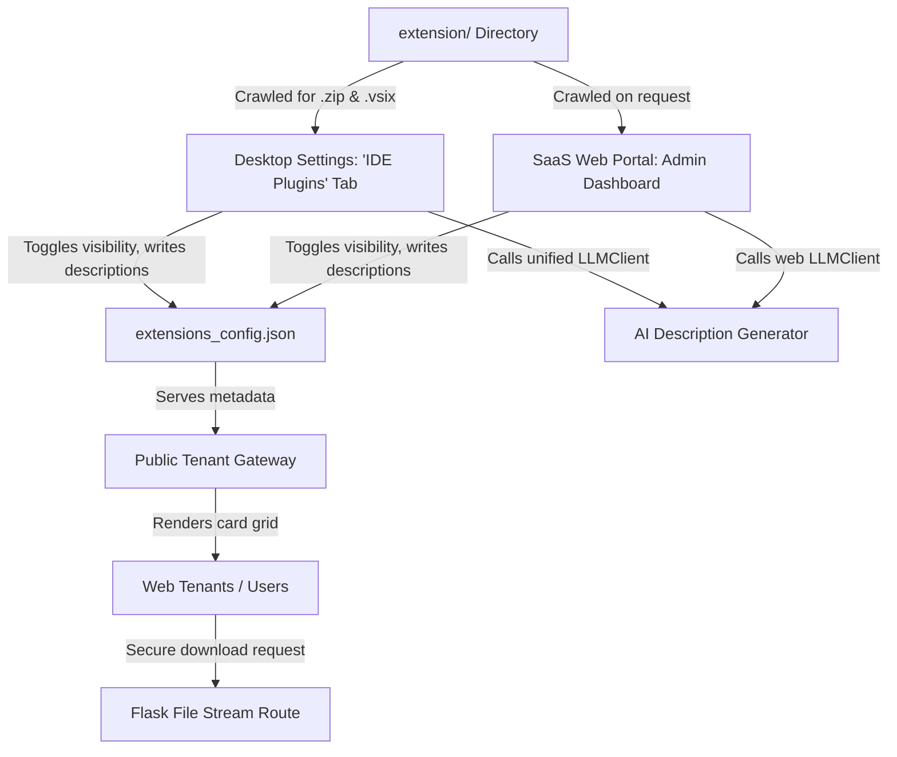

# Implementation Plan: SaaS IDE Extensions Distribution Portal (v7.3 Expansion)

This plan describes the architectural changes required to introduce a beautiful, high-fidelity **IDE Extensions Portal** into the **Synora Studio SaaS Gateway Web Application** and the **Native Desktop Administration Settings Dialog**. 

It combines a **Config-Driven Metadata Ledger** (Option 2) with an **AI-Assisted Administration Dashboard** (Option 1) to enable SaaS Admins to publish extensions and generate professional marketing/changelog copy dynamically using the active system LLM directly from both the Desktop GUI and Web admin consoles.

---

## Technical Architecture



---

## Proposed Changes

### 1. [NEW] [extensions_config.json](file:///c:/Users/user/OneDrive/Desktop/python/synora_studio/extension/extensions_config.json)
Provides an isolated, lightweight registry tracking file parameters:
```json
{
  "vscode-llm-chat-2.0.0.vsix": {
    "name": "VS Code Chat Integration",
    "version": "2.0.0",
    "platform": "vscode",
    "is_visible": true,
    "description": "### 🚀 LLM Chat Integration v2.0.0 for VS Code\nProvides real-time code completions...",
    "file_size": "17.5 KB",
    "updated_at": "2026-05-26"
  },
  "jetbrains-llm-chat-2.0.0.zip": {
    "name": "JetBrains AI Assistant",
    "version": "2.0.0",
    "platform": "jetbrains",
    "is_visible": true,
    "description": "### 🛡️ Unified Workspace Core for JetBrains IDEs\nEnforces hot-swappable viewport controls...",
    "file_size": "1.6 MB",
    "updated_at": "2026-05-26"
  }
}
```

---

### 2. [MODIFY] [saas_settings_dialog.py](file:///c:/Users/user/OneDrive/Desktop/python/synora_studio/ui/saas_settings_dialog.py)
We will dynamically inject the **"🔌 IDE Plugins"** tab programmatically into `self.ui.tabWidget` on initialization to avoid fragile XML changes:
* **Table of Extensions**: Lists crawled `.vsix` and `.zip` files from `extension/` alongside their file sizes and configured status.
* **Metadata Editor**:
  * **Visible Toggle**: A checkbox syncing `"is_visible": true/false`.
  * **Custom Description Box**: A robust `QPlainTextEdit` for Markdown copy.
  * **AI Draft Button**: Injects a button `🧠 AI Generate Description` connecting directly to a worker subthread running on the active `self.parent().llm_client`. It automatically drafts installation logs.
* **Saving Sequence**: Integrates into `on_save()` to serialize updates directly to `extensions_config.json`.

---

### 3. [MODIFY] [app.py](file:///c:/Users/user/OneDrive/Desktop/python/synora_studio/saas/app.py)
We will add four core API endpoints inside the web dashboard app factory:
1. **`GET /api/extensions`**:
   * Scans the `extension/` directory.
   * Cross-references with `extensions_config.json`.
   * Serves visible extensions to public users and the complete ledger to authorized admins.
2. **`POST /api/admin/extensions/save`**:
   * **Security**: Enforces SaaS passport admin token check.
   * Updates visibility and descriptions inside the JSON config.
3. **`POST /api/admin/extensions/generate-desc`**:
   * **Security**: Enforces admin check.
   * Feeds filename, platform, and framework to the active system `LLMClient` and returns an engaging Markdown changelog.
4. **`GET /api/extensions/download/<filename>`**:
   * Streams files safely from `extension/` using Flask's `send_from_directory` to prevent directory traversal exploits.

---

### 4. [NEW] [extensions.html](file:///c:/Users/user/OneDrive/Desktop/python/synora_studio/saas/templates/modals/extensions.html)
The web viewport dashboard modal:
* **Tenant UI**: A premium glassmorphic list with off-white high-contrast badges for platforms (blue themed for VS Code, violet/orange themed for JetBrains) rendering Markdown dynamically via `marked.js`.
* **Admin Controls**: Sub-controls displaying checkboxes, textareas, and **"🧠 AI Generate Description"** triggers with smooth loading spinners.

---

### 5. [MODIFY] [header.html](file:///c:/Users/user/OneDrive/Desktop/python/synora_studio/saas/templates/partials/header.html)
Add a navigation menu action **"🔌 IDE Plugins"** linking directly to render the extensions modal.

---

## Verification Plan

### Automated & Manual Testing
1. **Desktop GUI Alignment**:
   * Open the SaaS Node settings dialog in the desktop app.
   * Confirm the new **"🔌 IDE Plugins"** tab is cleanly appended with visual stylesheets matching the active system theme (dark/light).
   * Modify visibility and descriptions, save, and verify `extensions_config.json` updates correctly.
2. **Web Endpoint Authentications**:
   * Assert `GET /api/extensions` only exposes visible plugins for non-authenticated web sessions.
   * Verify all `POST /api/admin/extensions/*` requests are strictly gated, returning `401 Unauthorized` on missing passports.
3. **AI Generation Pipelines**:
   * Verify clicking the local or web AI buttons successfully invokes the prompt orchestrator and returns clean, structural markdown content.

---

## Git Commit Comments

```text
feat(saas): implement dynamic IDE extensions distribution portal in desktop & web

- Integrated dynamic '🔌 IDE Plugins' tab programmatically inside SaaSSettingsDialogClass
- Added 'extensions_config.json' config-driven registry for light metadata and visibility storage
- Created secure dynamic endpoints (`/api/extensions`, `/api/extensions/download/<file>`)
- Implemented `/api/admin/extensions/save` and `/api/admin/extensions/generate-desc`
- Connected active LLMClients (desktop/web) to draft engaging Markdown changelogs based on file attributes
- Rendered premium glassmorphic download viewports on SaaS Web Gateway for multi-tenant users
```
